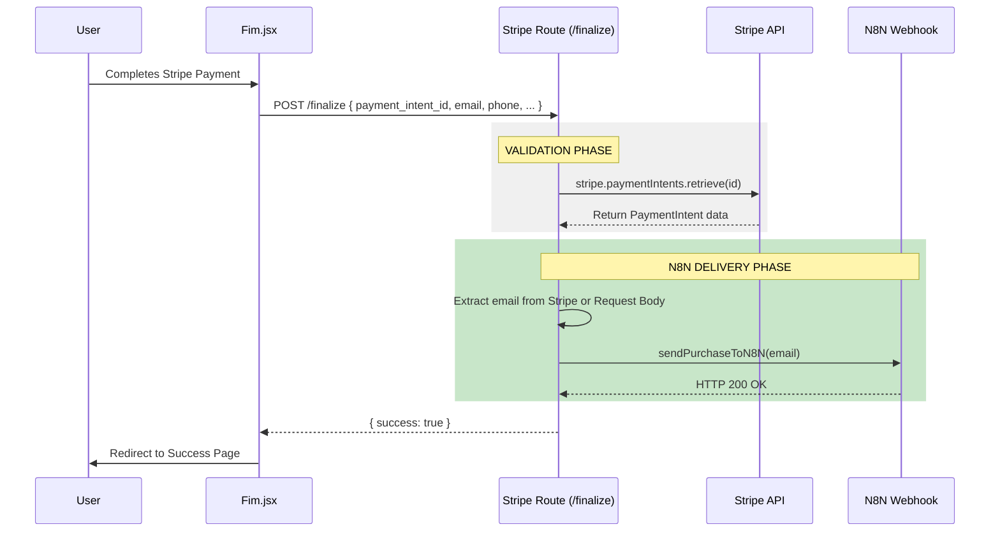
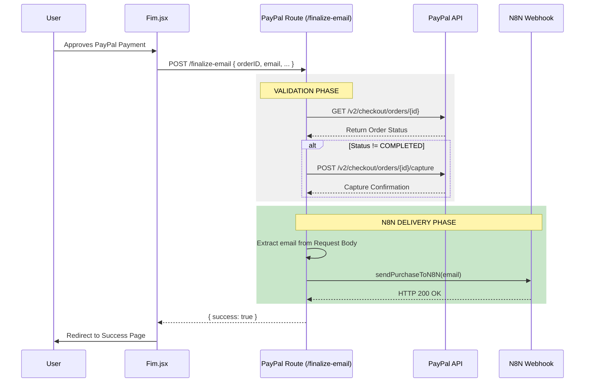

# N8N Purchase Email Delivery Flow (No Bypass)

This document represents the technical flow of sending purchase emails to N8N for automated delivery (e.g., via Email/WhatsApp) after a successful transaction.

## 1. Stripe Flow

The Stripe flow relies on the `payment_intent_id` to verify the transaction on the backend before triggering the N8N webhook.

### Key Logic Steps (Stripe):
1.  **Frontend**: Receives payment success from Stripe Elements/Modal.
2.  **Request**: Sends the `payment_intent_id` to the backend.
3.  **Verification**: Backend fetches the real transaction from Stripe to ensure it wasn't a fake request.
4.  **Email Extraction**: Prioritizes `receipt_email` from Stripe, then `billing_details`, then fallback to the body email.
5.  **N8N Trigger**: Sends a JSON payload `{ "email": "..." }` to the configured N8N Webhook.

---

## 2. PayPal Flow

The PayPal flow uses the `orderID` to verify the order status with PayPal's servers.

### Key Logic Steps (PayPal):
1.  **Frontend**: Receives the `orderID` after the user approves the payment in the PayPal popup.
2.  **Request**: Sends the `orderID` and user email to the backend.
3.  **Verification**: Backend checks if the order is `COMPLETED`. If it's only approved, it performs the `capture` to secure the funds.
4.  **N8N Trigger**: Once the order is confirmed as paid, it sends the JSON payload `{ "email": "..." }` to N8N.
