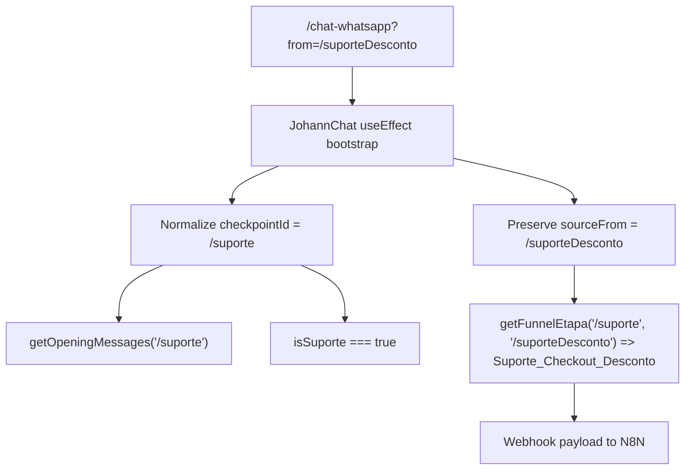

# JohannChat `/suporte` Base + Payload `Suporte_Checkout_Desconto` — Planning Output (v2)

> **Status:** PLANEJADO — Aguardando aprovação  
> **Data:** 2026-04-30  
> **Scope:** `[/chat-whatsapp?from=/suporteDesconto]`  
> **Files:** 2 arquivos (1 novo, 1 modificado)  
> **Risk:** 🟡 MEDIUM

---

## 1. Contexto

O fluxo atual do chat do Johann lê `?from=` a partir de `location.search`, normaliza prefixos de locale e usa esse valor como `checkpointId` interno. Hoje o checkpoint de suporte já existe como `/suporte`, com abertura própria, bypass do prepend de mentor na primeira entrada e classificação específica de webhook como `Suporte_Checkout`.

O ajuste solicitado agora é simples: usar `/suporte` como base do chat e, somente quando a origem for `from=/suporteDesconto`, enviar `etapa: 'Suporte_Checkout_Desconto'` para o N8N. A estratégia de menor risco é desacoplar "checkpoint visual" de "origem do payload": o componente continua usando `/suporte` para opening e comportamento do chat, mas preserva a origem bruta em um campo separado para derivar a etapa correta no webhook.

**Issue:** `JohannChat` hoje trata a etapa de suporte só pelo `checkpointId`, então não distingue o caso de desconto no payload.  
**Suspected Root Cause:** a origem bruta do `from` não é preservada depois da normalização inicial.  
**Target Outcome:** ao acessar `/chat-whatsapp?from=/suporteDesconto`, o chat abre como `/suporte`, mas o payload enviado ao N8N contém `etapa: 'Suporte_Checkout_Desconto'`.  
**Risks & Mitigation:** risco médio por tocar a classificação que alimenta o webhook. Mitigação: manter `/suporte` como base única de UI e usar `sourceFrom` apenas para segmentação do payload.

**Audit Summary**
- **Tracking hooks (`funnelTracker`):** não há `funnelTracker` em [JohannChat.jsx](file:///Users/brunogovas/Projects/Silver%20Bullet/Projetos/Funil_Quiz_2.0/SILVER-BULLET-AQUISICAO-FREQUENCIA/src/pages/JohannChat.jsx); o impacto de tracking aqui é indireto via payload do webhook N8N.
- **SCSS Module integration:** presente via `JohannChat.module.scss`.
- **State management patterns:** o componente usa `useState`, `useEffect`, `useRef` e deriva o checkpoint inicial da URL dentro de um `useEffect`.

**Point #1: Support Discount Alias**
├── Risk Level: 🟡 MEDIUM
├── Blast Radius: `JohannChat.jsx` bootstrap do checkpoint, opening sequence e payload do webhook
├── Regression Surface: classificação de etapa (`Suporte_Checkout` vs `Suporte_Checkout_Desconto`) e supressão do prepend `mentor_tracking`
└── Confidence: HIGH

**Nota de compatibilidade já existente:** `/suporte` hoje é um checkpoint lógico do chat, não um `Route path` registrado em [App.tsx](file:///Users/brunogovas/Projects/Silver%20Bullet/Projetos/Funil_Quiz_2.0/SILVER-BULLET-AQUISICAO-FREQUENCIA/src/App.tsx#L140-L157). Este ajuste não cria uma rota física nova; ele mapeia um alias de query param para o checkpoint de suporte e usa a origem bruta apenas para a segmentação do webhook.

---

## 2. Referência de Código Mapeada

> **REGRA MANDATÓRIA:** Toda referência de código existente que será utilizada, estendida ou servir de base para a implementação DEVE ser mapeada aqui com:
> - Link para o arquivo + linhas exatas
> - O código de referência transcrito (snippet real do repo)

### 2.1 Padrão existente de entrada no chat via `from`

[Fim.jsx](file:///Users/brunogovas/Projects/Silver%20Bullet/Projetos/Funil_Quiz_2.0/SILVER-BULLET-AQUISICAO-FREQUENCIA/src/pages/Fim.jsx#L886-L893)

```jsx
setTimeout(() => {
  const el = document.getElementById('plan-receipt-anchor')
  if (el) el.scrollIntoView({ behavior: 'smooth', block: 'center' })
}, 300);
}}
onRedirectChat={() => {
  navigate(`${isPtRoute ? '/pt' : '/de'}/chat-whatsapp?from=/fim-gift`);
}}
```

Anotação: este é o padrão já usado no funil para abrir o mesmo componente de chat com um `from` semântico na query string. O ajuste novo deve seguir esse mesmo contrato, sem criar uma nova rota React.

### 2.2 Bootstrap atual do checkpoint a partir da URL

[JohannChat.jsx](file:///Users/brunogovas/Projects/Silver%20Bullet/Projetos/Funil_Quiz_2.0/SILVER-BULLET-AQUISICAO-FREQUENCIA/src/pages/JohannChat.jsx#L194-L200)

```jsx
useEffect(() => {
    // 1. Identificar checkpoint da URL
    const searchParams = new URLSearchParams(location.search);
    let from = searchParams.get('from') || '/quiz';
    // Normalizar
    from = from.replace(/^\/main/, '').replace(/^\/(pt|de)/, '') || '/quiz';
    chatDataRef.current.checkpointId = from;
```

Anotação: este é o ponto de menor risco para inserir o alias. Toda a lógica posterior já depende de `chatDataRef.current.checkpointId`.

### 2.3 Estrutura atual do `chatDataRef`

[JohannChat.jsx](file:///Users/brunogovas/Projects/Silver%20Bullet/Projetos/Funil_Quiz_2.0/SILVER-BULLET-AQUISICAO-FREQUENCIA/src/pages/JohannChat.jsx#L178-L184)

```jsx
const isChatStartedRef = useRef(false);
const messagesEndRef = useRef(null);
const chatDataRef = useRef({
    checkpointId: '/quiz',
    leadData: {},
    session_id: 'ws_' + Date.now() + '_' + Math.random().toString(36).substr(2, 9)
});
```

Anotação: como o ref já centraliza os metadados do chat, ele é o melhor lugar para preservar `sourceFrom` sem introduzir novo `useState` e sem re-render desnecessário.

### 2.4 Mapeamento existente de suporte no opening e descrição de checkpoint

[JohannChat.jsx](file:///Users/brunogovas/Projects/Silver%20Bullet/Projetos/Funil_Quiz_2.0/SILVER-BULLET-AQUISICAO-FREQUENCIA/src/pages/JohannChat.jsx#L59-L62)

```jsx
'/recupera': t('johannChat.openings.recupera', { returnObjects: true }),

// Rota direta de Atendimento / Suporte (PT-PT)
'/suporte': t('johannChat.openings.suporte', { returnObjects: true }),
```

[JohannChat.jsx](file:///Users/brunogovas/Projects/Silver%20Bullet/Projetos/Funil_Quiz_2.0/SILVER-BULLET-AQUISICAO-FREQUENCIA/src/pages/JohannChat.jsx#L108-L110)

```jsx
'/fim-funil': '/fim-funil - Página de finalização do funil.',
'/audio-upsell': '/audio-upsell - Cliente JÁ COMPROU! Tela de Upsell.',
'/suporte': '/suporte - Lead acessou a página diretamente pedindo Suporte ou tendo dúvidas antes de comprar.',
```

Anotação: o alias deve reaproveitar exatamente este checkpoint de suporte, evitando duplicar mensagens e taxonomia.

### 2.5 Branches downstream já validadas para suporte

[JohannChat.jsx](file:///Users/brunogovas/Projects/Silver%20Bullet/Projetos/Funil_Quiz_2.0/SILVER-BULLET-AQUISICAO-FREQUENCIA/src/pages/JohannChat.jsx#L232-L245)

```jsx
// Lógica da primeira vez absoluta em qualquer backredirect/chat
const FIRST_BACKREDIRECT_KEY = 'whatsapp_first_backredirect_seen';
const isSuporte = chatDataRef.current.checkpointId === '/suporte';

if (!localStorage.getItem(FIRST_BACKREDIRECT_KEY)) {
    localStorage.setItem(FIRST_BACKREDIRECT_KEY, 'true');

    // Nunca exibir no suporte direto
    if (!isSuporte) {
        opening = [
            t('johannChat.ui.mentor_tracking'),
            ...(Array.isArray(opening) ? opening : [opening])
        ];
```

[JohannChat.jsx](file:///Users/brunogovas/Projects/Silver%20Bullet/Projetos/Funil_Quiz_2.0/SILVER-BULLET-AQUISICAO-FREQUENCIA/src/pages/JohannChat.jsx#L312-L349)

```jsx
const getFunnelEtapa = (route) => {
    const r = route || '';
    if (['/quiz', '/age-selection-men', '/ge-selection-men', '/age-selection-women', '/women-success', '/men-success', '/morning-feeling', '/transition', '/vsl', '/vsl2', '/vls'].includes(r)) {
        return 'curisosos';
    }
    if (r.startsWith('/quiz-step-') || r.startsWith('/compont-test-') || ['/processing', '/resultado', '/resultado-pressel'].includes(r)) {
        return 'exame';
    }
    if (r === '/fim') {
        return 'antes-pitch';
    }
    if (['/fim-pos-pitch', '/checkout', '/fim-funil'].includes(r)) {
        return 'pos-pitch';
    }
    if (r.includes('audio-upsell')) {
        return r === '/audio-upsell-pos-play' ? 'pos_audio_upsell' : 'antes_audio_upsell';
    }
    if (r === '/suporte') {
        return 'Suporte_Checkout';
    }
    return 'outros';
};

const route = chatDataRef.current.checkpointId;
const etapa = getFunnelEtapa(route);

let metodoPagamento = undefined;
try {
    if (etapa === 'Suporte_Checkout' || route === '/suporte') {
        metodoPagamento = localStorage.getItem('metodo_pagamento') || undefined;
```

Anotação: estas branches mostram que hoje a etapa depende apenas de `checkpointId`. Para suportar `Suporte_Checkout_Desconto` sem quebrar o opening, a implementação precisa introduzir uma derivação baseada na origem bruta do `from`.

---

## 3. Lógica de Implementação

> **REGRA MANDATÓRIA:** A lógica de implementação DEVE ser escrita e codificada neste documento ANTES de qualquer execução. Isso inclui:
> - Código novo criado para resolver o problema
> - Código encontrado via `context7` (documentação atualizada)
> - Código encontrado no repositório atual (padrões existentes)
> - Cada bloco deve indicar sua ORIGEM: `[CRIADO]`, `[CONTEXT7]`, ou `[REPO EXISTENTE]`

### 3.1 Query string reativa ao `location` do router

**Origem:** `[CONTEXT7]`

```tsx
const location = useLocation();

useEffect(() => {
  gtag("event", "page_view", {
    page_location: location.pathname + location.search,
  });
}, [location]);
```

Fluxo: a documentação atual do React Router confirma que `useLocation()` re-renderiza a cada navegação e é apropriado para derivar comportamento a partir de `location.search`. Isso valida manter a leitura do `from` no efeito já existente.

### 3.2 Preservação da origem bruta e normalização do alias `/suporteDesconto`

**Origem:** `[CRIADO]`

```jsx
const SUPPORT_CHECKPOINT_ALIASES = new Set(['/suporteDesconto']);

const normalizeChatCheckpoint = (from) => {
    if (SUPPORT_CHECKPOINT_ALIASES.has(from)) {
        return '/suporte';
    }

    return from;
};

useEffect(() => {
    const searchParams = new URLSearchParams(location.search);
    let rawFrom = searchParams.get('from') || '/quiz';

    rawFrom = rawFrom.replace(/^\/main/, '').replace(/^\/(pt|de)/, '') || '/quiz';
    const normalizedFrom = normalizeChatCheckpoint(rawFrom);

    chatDataRef.current.sourceFrom = rawFrom;
    chatDataRef.current.checkpointId = normalizedFrom;

    try {
        const raw = localStorage.getItem('lead_cache_app_espiritualidade');
        chatDataRef.current.leadData = raw ? JSON.parse(raw) : {};
    } catch (e) {
        console.error("Erro ao ler lead data", e);
    }

    if (!isChatStartedRef.current) {
        isChatStartedRef.current = true;
        const localizedOpenings = getOpeningMessages(t);
        startOpeningSequence(normalizedFrom, localizedOpenings);
    }
}, [t]);
```

Fluxo: o alias é convertido para `/suporte` apenas para comportamento visual, enquanto `sourceFrom` preserva `/suporteDesconto` para as regras do webhook.

### 3.3 Derivação da etapa especial para o N8N

**Origem:** `[CRIADO]`

```jsx
const getFunnelEtapa = (route, sourceFrom) => {
    const r = route || '';
    const source = sourceFrom || '';

    if (source === '/suporteDesconto') {
        return 'Suporte_Checkout_Desconto';
    }

    if (['/quiz', '/age-selection-men', '/ge-selection-men', '/age-selection-women', '/women-success', '/men-success', '/morning-feeling', '/transition', '/vsl', '/vsl2', '/vls'].includes(r)) {
        return 'curisosos';
    }
    if (r.startsWith('/quiz-step-') || r.startsWith('/compont-test-') || ['/processing', '/resultado', '/resultado-pressel'].includes(r)) {
        return 'exame';
    }
    if (r === '/fim') {
        return 'antes-pitch';
    }
    if (['/fim-pos-pitch', '/checkout', '/fim-funil'].includes(r)) {
        return 'pos-pitch';
    }
    if (r.includes('audio-upsell')) {
        return r === '/audio-upsell-pos-play' ? 'pos_audio_upsell' : 'antes_audio_upsell';
    }
    if (r === '/suporte') {
        return 'Suporte_Checkout';
    }

    return 'outros';
};

const route = chatDataRef.current.checkpointId;
const sourceFrom = chatDataRef.current.sourceFrom;
const etapa = getFunnelEtapa(route, sourceFrom);
```

Fluxo: a etapa de desconto fica isolada numa condição explícita e prioritária, sem alterar a abertura nem o `checkpoint_abandono` textual já existente.

### 3.4 Reaproveitamento das regras downstream já existentes

**Origem:** `[REPO EXISTENTE]`

```jsx
const isSuporte = chatDataRef.current.checkpointId === '/suporte';

if (!localStorage.getItem(FIRST_BACKREDIRECT_KEY)) {
    localStorage.setItem(FIRST_BACKREDIRECT_KEY, 'true');

    if (!isSuporte) {
        opening = [
            t('johannChat.ui.mentor_tracking'),
            ...(Array.isArray(opening) ? opening : [opening])
        ];
    }
}

if (r === '/suporte') {
    return 'Suporte_Checkout';
}
```

Fluxo: mesmo com a etapa especial de desconto, `checkpointId` continua em `/suporte`, então o opening e o bypass de mentor seguem estáveis e reaproveitados.

---

## 4. Arquitetura de Componentes



---

## 5. CSS/SCSS Reference

Nenhuma alteração visual é necessária para este ajuste. O chat já usa `SCSS Module`, e a mudança proposta atua apenas na normalização do query param.

### 5.1 Shell visual existente do JohannChat

[JohannChat.module.scss](file:///Users/brunogovas/Projects/Silver%20Bullet/Projetos/Funil_Quiz_2.0/SILVER-BULLET-AQUISICAO-FREQUENCIA/src/pages/JohannChat.module.scss#L3-L23)

```scss
.whatsappContainer {
    position: fixed;
    top: 0;
    left: 0;
    right: 0;
    bottom: 0;
    width: 100%;
    height: 100vh;
    height: 100dvh;
    display: flex;
    flex-direction: column;
    background-color: #EDEDED;
    overflow: hidden !important;
    font-family: 'Roboto', sans-serif;
    z-index: 9999;

    * {
        box-sizing: border-box;
    }
}
```

**Adaptações necessárias:**

| Propriedade | Valor Original | Novo Valor |
|-------------|---------------|------------|
| `N/A` | `N/A` | `Sem alteração` |

---

## 6. Novos Componentes

Nenhum componente novo é necessário para este ajuste.

---

## 7. Componentes Modificados

### 7.1 JohannChat.jsx

**Novos states/hooks:**
```js
// Nenhum novo state ou hook React.
// Apenas constantes/helpers e um novo metadado em chatDataRef.
const SUPPORT_CHECKPOINT_ALIASES = new Set(['/suporteDesconto']);
```

**Modificações no código existente:**
```jsx
useEffect(() => {
    const searchParams = new URLSearchParams(location.search);
    let rawFrom = searchParams.get('from') || '/quiz';

    rawFrom = rawFrom.replace(/^\/main/, '').replace(/^\/(pt|de)/, '') || '/quiz';
    const normalizedFrom = normalizeChatCheckpoint(rawFrom);

    chatDataRef.current.sourceFrom = rawFrom;
    chatDataRef.current.checkpointId = normalizedFrom;
```

**Props adicionais para sub-componentes:**
```jsx
// Nenhuma.
```

---

## 8. i18n Keys (se aplicável)

### 8.1 Novas Chaves

```json
{}
```

### 8.2 Plano de Verificação Anti-Reversão

```bash
rg -n '"suporte"' \
  /Users/brunogovas/Projects/Silver\ Bullet/Projetos/Funil_Quiz_2.0/SILVER-BULLET-AQUISICAO-FREQUENCIA/src/i18n/locales/pt/translation.json \
  /Users/brunogovas/Projects/Silver\ Bullet/Projetos/Funil_Quiz_2.0/SILVER-BULLET-AQUISICAO-FREQUENCIA/src/i18n/locales/de/translation.json
```

---

## 9. Files Summary

| Action | File | Risk |
|--------|------|------|
| **NEW** | `/Users/brunogovas/Projects/Silver Bullet/Projetos/Funil_Quiz_2.0/SILVER-BULLET-AQUISICAO-FREQUENCIA/docs/sessions/2026-04/johannchat-suporte-desconto-planning.md` | 🟢 LOW |
| **MODIFY** | `/Users/brunogovas/Projects/Silver Bullet/Projetos/Funil_Quiz_2.0/SILVER-BULLET-AQUISICAO-FREQUENCIA/src/pages/JohannChat.jsx` | 🟡 MEDIUM |

---

## 10. Implementation Order

1. **Phase A:** adicionar a constante local de aliases de suporte em `JohannChat.jsx`.
2. **Phase B:** persistir `sourceFrom` no `chatDataRef` e normalizar `from=/suporteDesconto` para `/suporte` imediatamente após a limpeza de locale.
3. **Phase C:** ajustar `getFunnelEtapa` para retornar `Suporte_Checkout_Desconto` quando `sourceFrom === '/suporteDesconto'`.
4. **Phase D:** validar que o opening, o bypass de mentor e o `checkpoint_abandono` continuam vindo do código existente.

---

## 11. Rollback Plan

```bash
Point #1 Rollback:
├── Git Reference: abab951
├── Files to Revert: /Users/brunogovas/Projects/Silver Bullet/Projetos/Funil_Quiz_2.0/SILVER-BULLET-AQUISICAO-FREQUENCIA/src/pages/JohannChat.jsx
├── Revert Command: git checkout abab951 -- /Users/brunogovas/Projects/Silver\ Bullet/Projetos/Funil_Quiz_2.0/SILVER-BULLET-AQUISICAO-FREQUENCIA/src/pages/JohannChat.jsx
└── Post-Revert Validation: abrir /chat-whatsapp?from=/suporteDesconto e confirmar que a etapa volta a não distinguir o caso de desconto
```

---

## 12. Verification Plan

| # | Test Case | Route | Expected |
|---|-----------|-------|----------|
| 1 | Abrir chat com alias novo | `/chat-whatsapp?from=/suporteDesconto` | opening de suporte é exibido sem prepend `mentor_tracking` na primeira entrada |
| 2 | Validar classificação do webhook com desconto | `/chat-whatsapp?from=/suporteDesconto` | payload usa `route=/suporte` internamente e `etapa=Suporte_Checkout_Desconto` |
| 3 | Regressão do suporte original | `/chat-whatsapp?from=/suporte` | comportamento permanece idêntico ao atual |
| 4 | Regressão de checkpoint não relacionado | `/chat-whatsapp?from=/fim-gift` | comportamento existente continua inalterado |
| 5 | Prefixo de locale no alias | `/pt/chat-whatsapp?from=/suporteDesconto` e `/de/chat-whatsapp?from=/suporteDesconto` | alias continua resolvendo para `/suporte` |

---

## 13. Handoff (se aplicável)

### 13.1 N8N / Webhook de chat

- **O que é necessário:** o N8N precisa aceitar o novo valor de `payload.etapa = Suporte_Checkout_Desconto`. O restante do contrato pode permanecer igual.
- **Documento de handoff:** este planejamento é suficiente; não há handoff externo adicional previsto enquanto o alias continuar colapsando para `/suporte`.
