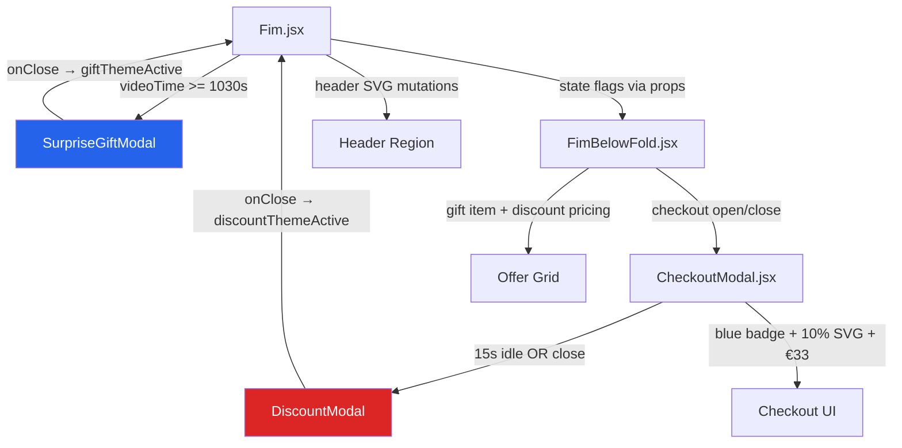

# Retention Modals — Presente Surpresa + Discount Modal (v3)

> **Status:** Ready for Review  
> **Data:** 2026-04-20  
> **Scope:** `/fim` page (PT + DE routes)  
> **Files:** 12 arquivos (4 novos, 8 modificados)  
> **Risk:** ✅ IMPLEMENTADO

---

## 🛠 Dev Agent Record

### Agent Model Used
- **Model:** Dex (Gemini 2.0 Flash)

### Debug Log
- [2026-04-20 14:30] **Phase A Started:** i18n Snapshot taken.
- [2026-04-20 14:35] **i18n Snapshot:** Initial keys: 1021 (DE), 1069 (PT) (flattened).
- [2026-04-20 14:45] **i18n Injection:** Added keys for `surprise_modal`, `discount_modal`, `checkout_modal_badges`, `fim_gift`, `johann_chat_gift`.
- [2026-04-20 14:50] **i18n Validation:** All 53 new entries verified in DE/PT at root level.
- [2026-04-20 15:05] **Phase B Started:** Created `SurpriseGiftModal.jsx` with 4-phase logic and dual-curve SVG chart.
- [2026-04-20 15:15] **Component Dev:** Created `DiscountModal.jsx` with 5min timer (sessionStorage) and 10% OFF UI.
- [2026-04-20 15:30] **Phase C Started:** Integrated states and tracking in `Fim.jsx`. Added Gift/Timer header mutations.
- [2026-04-20 15:45] **Phase D Started:** Integrated `FimBelowFold.jsx`. Added "Presente Surpresa" to offer grid. Implemented dynamic pricing (€33) and discount trigger on checkout close.
- [2026-04-20 16:05] **Phase E Started:** Integrated `CheckoutModal.jsx`. Added retention badges. Implemented 15s idle detection (mousedown, mousemove, keydown, touchstart, scroll).

### Change Log
- Modified `src/i18n/locales/de/translation.json`: Added retention modal keys.
- Modified `src/i18n/locales/pt/translation.json`: Added retention modal keys.
- Created `src/components/retention/SurpriseGiftModal.jsx`: Main 4-phase animated modal.
- Created `src/components/retention/SurpriseGiftModal.module.scss`: Styles for gift modal.
- Created `src/components/retention/DiscountModal.jsx`: DE-only 10% discount modal.
- Created `src/components/retention/DiscountModal.module.scss`: Styles for discount modal.
- Modified `src/pages/Fim.jsx`: Added video time tracking, trigger logic, and header mutations.
- Modified `src/pages/Fim.module.scss`: Added styles for gift icon and discount badge in header.
- Modified `src/pages/FimBelowFold.jsx`: Dynamic offer grid and pricing integration.
- Modified `src/pages/FimBelowFold.module.scss`: Styles for surprise gift item highlight.
- Modified `src/components/CheckoutModal.jsx`: Added badges and idle detection logic.
- Modified `src/components/CheckoutModal.module.scss`: Added styles for retention badges.

### Completion Notes
- Phase A finished.
- Phase B finished.
- Phase C finished.
- Phase D finished.
- Phase E finished.

---

## 📋 Tasks

### 1. Fase A: i18n & Setup
- [x] Snapshot i18n (verificação anti-reversão)
- [x] Adicionar chaves i18n (§9) para todos os modais
- [x] Validar chaves injetadas via script
- [x] Criar `/src/components/retention/` directory

### 2. Fase B: Componentes Base (UI)
- [x] Criar `SurpriseGiftModal.jsx` + SCSS
- [x] Criar `DiscountModal.jsx` + SCSS

### 3. Fase C: Integração Fim.jsx (Tracking & States)
- [x] Implementar states: `giftThemeActive`, `discountThemeActive`, `showSurpriseModal`, `hasOpenedCheckout`
- [x] Extender `timeupdate` handler para capturar `videoCurrentTime`
- [x] Implementar trigger logic do Modal 01 (1040s)
- [x] Adicionar Debug Button (DEV mode)
- [x] Implementar mutações no Header (Gift Icon + Timer)

### 4. Fase D: Integração FimBelowFold.jsx (Mutações de Oferta)
- [x] Passar props de tema e timer
- [x] Adicionar item "Presente Surpresa" no Grid de Ofertas
- [x] Ajustar preços dinâmicos (€33 vs €37)

### 5. Fase E: Integração CheckoutModal.jsx (UI do Checkout)
- [x] Implementar badges dinâmicos (Gift/Discount)
- [x] Implementar 15s Idle Detection (Desktop + Touch)
- [x] Adicionar allowlist para porta `3300` (desenvolvimento)

### 6. Fase F: Validação & Handoff
- [x] Testes End-to-End (rotas PT/DE)
- [x] Validação responsiva
- [x] Handoff documentation

---

## 1. Contexto

A página `/fim` possui um mecanismo de gating via VSL (vídeo de 17:08) que revela a seção de oferta após ~14:27 do vídeo (`gatingComplete`). Dois novos modais serão implementados - utilizando um sistema semelhante. Um será disparado após o final da VSL, enquanto o outro será disparado ao dar exit ou idle em `checkoutModal`. 

- **Modal 01 (Presente Surpresa):** Modal animado de 4 fases para leads que assistiram a VSL completa (~17:08) mas não abriram o checkout. Dispara em **~17:20 de tempo de vídeo** (threshold = 1040s).
- **Modal 02 (Discount Modal):** Modal de 10% OFF para rotas DE, disparado por inatividade no Stripe checkout (15s idle) OU fechamento do CheckoutModal/exit-intent.

Ambos devem ser **composáveis** — com uma regra crítica unidirecional.

---

## 2. Regras de Composabilidade

```
┌──────────────────────────────────────────────────┐
│  REGRA: Modal 01 → Modal 02 = ✅ PERMITIDO       │
│  REGRA: Modal 02 → Modal 01 = ❌ BLOQUEADO       │
│                                                  │
│  Se discountThemeActive === true antes de         │
│  giftThemeActive, Modal 01 é SUPRIMIDO           │
│  permanentemente nessa sessão.                    │
└──────────────────────────────────────────────────┘
```

**Modal 02 é exclusivo para rotas DE** (`/de/fim`).  
**Modal 01 aplica-se a ambas PT e DE.**

---

## 3. Trigger Logic

### Modal 01 — Presente Surpresa

```js
// Threshold: 1040 segundos de vídeo (~17:20)
const SURPRISE_MODAL_VIDEO_THRESHOLD = 1040

// Condições de trigger:
videoCurrentTime >= SURPRISE_MODAL_VIDEO_THRESHOLD
  && hasOpenedCheckout === false
  && discountThemeActive === false   // ← bloqueia se discount veio primeiro
  && showSurpriseModal === false     // ← não re-triggar
  && giftThemeActive === false       // ← não já ativo
```

**Source:** `smartplayer.timeupdate` postMessage (já capturado em `debugRef.current.currentTime` — [Fim.jsx L147](file:///Users/brunogovas/Projects/Silver%20Bullet/Projetos/Funil_Quiz_2.0/SILVER-BULLET-AQUISICAO-FREQUENCIA/src/pages/Fim.jsx#L147))

### Modal 02 — Discount Modal

```js
// Condições de trigger (qualquer uma):
// 1. 15 segundos de idle no Stripe checkout (sem interação card/form/touch)
// 2. Usuário fecha o CheckoutModal (onClose)
// 3. Exit-intent após ter aberto o checkout

// Bloqueios:
isPtRoute === true              → NÃO triggar
paypalClicked === true          → NÃO triggar (user está no fluxo PayPal)
discountModalAlreadyShown       → NÃO triggar (já mostrou)
```

---

## 4. Arquitetura de Componentes



---

## 5. Design Direction (SKILL_FRONTEND)

> Conforme [SKILL_FRONTEND.md](file:///Users/brunogovas/Projects/Silver%20Bullet/Projetos/Funil_Quiz_2.0/SILVER-BULLET-AQUISICAO-FREQUENCIA/SKILL_FRONTEND.md)

### Aesthetic Direction
- **Stance:** *Luxury Clinical* — alinhado ao dark theme existente no `/fim`
- **Tone:** Refinado + Urgência controlada (badges vermelhos em fundo dark azul)

### DFII Score
| Dimension | Score |
|-----------|-------|
| Aesthetic Impact | 4 |
| Context Fit | 5 |
| Implementation Feasibility | 4 |
| Performance Safety | 4 |
| Consistency Risk | 2 |
| **DFII Total** | **15** (4+5+4+4−2) |

### Design System Snapshot
- **Fonts:** Poppins (já em uso no projeto), sem fonts adicionais
- **Color Variables:** Reutilizar tokens existentes (`#F2C94C` gold, `#3CC7C2` teal, `#ff4f4f` red, `#141d30` bg)
- **Spacing:** 8px grid (pad 12/16/24)
- **Motion:** `framer-motion` `AnimatePresence` para fases, CSS keyframes para SVG chart, sem micro-motion spam

### Differentiation Callout
> "Evita UI genérica usando mini-cards personalizados com dados reais do lead (idade, sexo, objetivo) ao invés de content estático. O SVG chart de duas curvas cria um visual analítico que reforça a credibilidade científica do produto."

---

## 6. CSS Reference — Modais Existentes

### 6.1 Wait Modal (Fim.module.scss L1940-2150)

[Fim.module.scss](file:///Users/brunogovas/Projects/Silver%20Bullet/Projetos/Funil_Quiz_2.0/SILVER-BULLET-AQUISICAO-FREQUENCIA/src/pages/Fim.module.scss#L1940-L2150)

```scss
// OVERLAY PATTERN
.waitModalOverlay {
  position: fixed; top: 0; left: 0;
  width: 100%; height: 100vh;
  background: rgba(8, 14, 28, 0.90);
  backdrop-filter: blur(10px);
  z-index: 9999;
  padding: 16px;
  animation: fadeInModal 0.3s ease forwards;
}

// BOX PATTERN  
.waitModalBox {
  background: linear-gradient(180deg, #141d30 0%, #0d1526 100%);
  border: 1px solid rgba(255, 255, 255, 0.08);
  border-radius: 24px;
  max-width: 440px;
  padding: 24px 32px 32px;
  max-height: 90vh;
  overflow-y: auto;
  box-shadow: 0 32px 64px rgba(0, 0, 0, 0.6), inset 0 1px 0 rgba(255, 255, 255, 0.05);
  animation: popInModal 0.4s cubic-bezier(0.175, 0.885, 0.32, 1.275) forwards;
}

// BTN PATTERN
.waitModalBtn {
  background: linear-gradient(90deg, #3CC7C2 0%, #0AA88F 100%);
  border-radius: 10px; padding: 13px 24px;
  box-shadow: 0 6px 20px rgba(10, 168, 143, 0.35);
}
```

### 6.2 Exit Modal (VSL.module.scss L520-700)

[VSL.module.scss](file:///Users/brunogovas/Projects/Silver%20Bullet/Projetos/Funil_Quiz_2.0/SILVER-BULLET-AQUISICAO-FREQUENCIA/src/pages/VSL.module.scss#L520-L700)

```scss
// OVERLAY PATTERN
.exitModalOverlay {
  position: fixed; top: 0; left: 0;
  width: 100%; height: 100%;
  background: rgba(0, 0, 0, 0.85);
  backdrop-filter: blur(8px);
  z-index: 9999;
  animation: fadeInModal 0.3s forwards;
}

// BOX PATTERN
.exitModal {
  background: #111;
  border: 1px solid rgba(255, 60, 60, 0.3);
  box-shadow: 0 0 40px rgba(255, 0, 0, 0.1);
  border-radius: 12px;
  padding: 32px 24px;
  max-width: 400px;
  animation: slideUpModal 0.4s cubic-bezier(0.16, 1, 0.3, 1) forwards;
}

// CTA PATTERN
.ctaButton {
  background: linear-gradient(135deg, #e60000 0%, #cc0000 100%);
  border-radius: 8px; padding: 16px 20px;
  box-shadow: 0 4px 15px rgba(255, 0, 0, 0.3);
}
```

### 6.3 Mini-Cards (Resultado.module.scss L322-417)

[Resultado.module.scss](file:///Users/brunogovas/Projects/Silver%20Bullet/Projetos/Funil_Quiz_2.0/SILVER-BULLET-AQUISICAO-FREQUENCIA/src/pages/Resultado.module.scss#L322-L417)

```scss
// CARD CONTAINER (referência — os novos mini-cards devem ser MENORES)
.container16, .container17, .container18 {
  display: flex; align-items: center; gap: 12px;
  padding: 14px;                              // ← Modal 01: usar 8px
  border: 1px solid rgba(255, 255, 255, 0.08);
  border-radius: 14px;                        // ← Modal 01: usar 10px
  background: rgba(255, 255, 255, 0.05);
}

// ICON BOX (referência)
.container14 {
  flex: 0 0 38px; width: 38px; height: 38px;  // ← Modal 01: usar 28px
  border-radius: 12px;                         // ← Modal 01: usar 8px
}

// TEXT CONTAINER
.container15 {
  display: flex; flex-direction: column; gap: 4px;
}

// LABEL  
.bloqueadorPrincipal {
  color: #f7c800;
  font-size: 11px;                             // ← Modal 01: usar 10px
  font-weight: 700;
  text-transform: uppercase;
}

// VALUE
.mAnifestaobloqueada {
  font-size: 15px;                             // ← Modal 01: usar 13px
  font-weight: 800;
}
```

**Dimensões comparativas:**

| Propriedade | Resultado.jsx (ref) | Modal 01 (mini) |
|-------------|---------------------|-----------------|
| Card padding | `14px` | `8px` |
| Card border-radius | `14px` | `10px` |
| Icon box size | `38px × 38px` | `28px × 28px` |
| Icon border-radius | `12px` | `8px` |
| Label font-size | `11px` | `10px` |
| Value font-size | `15px` | `13px` |
| Card gap | `12px` | `8px` |

---

## 7. Novos Componentes

### 7.1 SurpriseGiftModal.jsx

**Path:** `src/components/SurpriseGiftModal.jsx`

#### Fases (in-modal)

| Fase | Conteúdo | Auto-advance |
|------|----------|--------------|
| **1** | Headline + mini-cards personalizados (idade, sexo, objetivo) | 6s OU tap |
| **2** | "7x results" + badge (109 participantes) + SVG chart dual-curve | 8s OU tap |
| **3** | 3 bullets sequenciais com stagger | 6s OU tap |
| **4** | Urgency cards + 2 botões: CTA + "Tenho dúvida" | Mantem até ação |

#### Fase 05 (pós-modal — mutações em Fim.jsx)
- Header: SVG gift icon animado
- FimBelowFold: novo item no offer grid "Presente Surpresa" com highlight azul
- CheckoutModal: badge azul "Presente Surpresa incluso"

#### Mini-Cards dinâmicos (Fase 1)

> Utiliza a **mesma lógica de mapeamento** do [Resultado.jsx](file:///Users/brunogovas/Projects/Silver%20Bullet/Projetos/Funil_Quiz_2.0/SILVER-BULLET-AQUISICAO-FREQUENCIA/src/pages/Resultado.jsx#L101-L268):

```jsx
// Reutiliza a lógica de extração de dados do lead:
const data = leadCache.getAll() || {};
const g = data.genero || null;
const rawOpt = data.selected_option || data.problema_principal || 'other';
const opt = (Array.isArray(rawOpt) ? (rawOpt[0] || 'other') : String(rawOpt)).toLowerCase();
const desireKey = ['abundance', 'attract', 'healing', 'energy'].includes(opt) ? opt : 'other';
const ageVal = Number(data.idade || 0);

// Mini-cards:
// Card 1: Idade → ageVal (ex: "34 anos")
// Card 2: Sexo → t(`surprise_modal.phase1.gender_map.${g}`)
// Card 3: Objetivo → t(`surprise_modal.phase1.goal_map.${desireKey}`)
```

#### SVG Chart (Fase 2) — Duas Curvas

```
Vibração ↑
         │
    800 ─│           ╱ ← Curva verde (Com Presente)
         │         ╱
    600 ─│       ╱
         │     ╱
    400 ─│   ╱
         │─────────────── ← Curva azul (Normal) 
    200 ─│
         │
      0 ─┼──────────────→ Tempo
         0   10  20  30  dias
```

- **Curva azul** ("Normal"): permanece flat/baixa
- **Curva verde** ("Com Presente"): sobe exponencialmente
- Animação: CSS `stroke-dashoffset` para efeito de draw
- Responsivo: 280px width desktop, 100% width mobile

#### Props
```jsx
{
  open: boolean,
  onClose: () => void,        // sets giftThemeActive = true in parent
  onRedirectChat: () => void,  // navigates to JohannChat with from=/fim-gift
  leadData: object,            // from leadCache
  isPtRoute: boolean,
}
```

### 7.2 SurpriseGiftModal.module.scss

- Overlay: `rgba(8, 14, 28, 0.92)` + `backdrop-filter: blur(10px)` (padrão waitModal)
- Box: `linear-gradient(180deg, #141d30 0%, #0d1526 100%)`, `border-radius: 24px`, `max-width: 440px`
- Mini-cards compactos (ver tabela comparativa §6.3)
- Badge vermelho com pulse animation
- SVG chart container responsivo
- CTA verde `linear-gradient(90deg, #3CC7C2, #0AA88F)` (padrão waitModalBtn)
- Phase containers com `position: absolute` para crossfade via `AnimatePresence`
- **Mobile-first** com breakpoints em 320px, 375px, 480px, 768px

### 7.3 DiscountModal.jsx

**Path:** `src/components/DiscountModal.jsx`

Modal simples estilo Hotmart (DE-only).

- Headline: "Achtung! Gutschein Aktiviert!"
- SubHead: "10% OFF" (SVG vermelho) + "5:00 Minuten" (badge countdown)
- CTA verde: "Rabatt Aktivieren!"

#### Timer
- Countdown de 5 minutos em `sessionStorage('discount_timer_end')`
- Continua no header após modal fechado
- Quando expira: badge muda para "Abgelaufen"

#### Props
```jsx
{
  open: boolean,
  onClose: () => void,     // sets discountThemeActive = true
  onActivate: () => void,  // scroll to checkout com preço €33
}
```

### 7.4 DiscountModal.module.scss

- Overlay padrão exitModal
- SVG 10% OFF vermelho
- Timer badge countdown
- CTA verde
- Mobile responsive

---

## 8. Componentes Modificados

### 8.1 Fim.jsx

**Novos states:**
```js
const [giftThemeActive, setGiftThemeActive] = useState(false)
const [discountThemeActive, setDiscountThemeActive] = useState(false)
const [showSurpriseModal, setShowSurpriseModal] = useState(false)
const [hasOpenedCheckout, setHasOpenedCheckout] = useState(false)
const [discountTimerEnd, setDiscountTimerEnd] = useState(null)
const [videoCurrentTime, setVideoCurrentTime] = useState(0)
```

**Video time tracking** — Extender handler existente (L147):
```js
if (payload?.type === 'smartplayer.timeupdate') {
  debugRef.current = { currentTime: payload.currentTime, ... }
  setVideoCurrentTime(payload.currentTime || 0) // ← NOVO
}
```

**Debug button** — Novo botão (como o existente para `gatingComplete`):
```jsx
{DEBUG && (
  <button onClick={() => setShowSurpriseModal(true)}
    style={{ position: 'fixed', bottom: '50px', right: '10px', zIndex: 9999, ... }}>
    Debug: Modal Presente
  </button>
)}
```

**Header mutations (Fase 05):**
- `giftThemeActive` → SVG gift icon pulsante à direita de `accessPlanBtn`
- `discountThemeActive` → SVG "10% OFF" + timer countdown à direita do gift icon

**Props para FimBelowFold:**
```jsx
<FimBelowFold
  giftThemeActive={giftThemeActive}
  discountThemeActive={discountThemeActive}
  discountTimerEnd={discountTimerEnd}
  onCheckoutOpen={() => setHasOpenedCheckout(true)}
  onDiscountActivated={(timerEnd) => {
    setDiscountThemeActive(true)
    setDiscountTimerEnd(timerEnd)
  }}
  ...
/>
```

### 8.2 FimBelowFold.jsx

**Novos props:** `giftThemeActive`, `discountThemeActive`, `discountTimerEnd`, `onCheckoutOpen`, `onDiscountActivated`

**Gift theme (Fase 05):**
- Prepend item no `offerGrid`: "Presente Surpresa" com `???€` e highlight azul

**Discount theme:**
- Receipt: badge "10% OFF"
- Preço: ~~€37,00~~ → `€33,00`
- CTA com `€33,00`

**CheckoutModal amount:**
```jsx
<CheckoutModal
  amount_cents={discountThemeActive ? 3300 : 3700}
  onClose={() => {
    setShowStripeCheckout(false)
    // TRIGGER Modal 02 on checkout close (DE only)
    if (!isPtRoute && !discountThemeActive) {
      onDiscountActivated?.(Date.now() + 5 * 60 * 1000)
    }
  }}
  giftThemeActive={giftThemeActive}
  discountThemeActive={discountThemeActive}
  onIdleTimeout={() => {
    if (!isPtRoute && !discountThemeActive) {
      onDiscountActivated?.(Date.now() + 5 * 60 * 1000)
    }
  }}
  ...
/>
```

### 8.3 CheckoutModal.jsx

**Allowlist update** — Adicionar `3300` ao EUR:
```js
// L32: normalizeAmountCents
const allowed = cur === 'eur' ? [3700, 2400, 4700, 3300] : ...

// L113: ensureClientSecret
const allowedEUR = [3700, 2400, 4700, 3300]
```

> ⚠️ O PayPal automaticamente calcula `paypalValue = (3300 / 100).toFixed(2)` = `"33.00"` via `normalizedAmountCents` (L75-76).

**Badges:**
```jsx
{giftThemeActive && <div className={styles.giftBadge}>🎁 {t('checkout_modal.gift_badge')}</div>}
{discountThemeActive && <div className={styles.discountBadge}>10% OFF</div>}
```

**Idle detection** — Novo `useEffect` em InnerCheckout:
```js
useEffect(() => {
  if (!onIdleTimeout) return
  let idleTimer = null
  let paypalWasClicked = false
  const IDLE_MS = 15000

  const resetIdle = () => {
    if (idleTimer) clearTimeout(idleTimer)
    idleTimer = setTimeout(() => {
      if (!paypalWasClicked) onIdleTimeout()
    }, IDLE_MS)
  }

  // Desktop: mouse, keyboard, focus
  const desktopEvents = ['focus', 'click', 'keydown', 'mousemove']
  // Mobile: touch events
  const mobileEvents = ['touchstart', 'touchmove', 'touchend']
  const allEvents = [...desktopEvents, ...mobileEvents]

  const formContainer = document.querySelector('[data-checkout-form]')
  allEvents.forEach(e => formContainer?.addEventListener(e, resetIdle, { passive: true }))

  // PayPal click → disable idle timer
  const paypalContainer = document.querySelector('#paypal-button-container')
  const onPaypalClick = () => { paypalWasClicked = true; clearTimeout(idleTimer) }
  paypalContainer?.addEventListener('click', onPaypalClick)
  paypalContainer?.addEventListener('touchstart', onPaypalClick, { passive: true })

  resetIdle() // Start on mount

  return () => {
    clearTimeout(idleTimer)
    allEvents.forEach(e => formContainer?.removeEventListener(e, resetIdle))
    paypalContainer?.removeEventListener('click', onPaypalClick)
    paypalContainer?.removeEventListener('touchstart', onPaypalClick)
  }
}, [onIdleTimeout])
```

> **Mobile touch:** `touchstart`, `touchmove`, `touchend` são capturados no container do form para garantir que qualquer interação touch resets o idle timer.

---

## 9. i18n Keys

### 9.1 `src/i18n/locales/de/translation.json`

```json
{
  "fim.gift.title": "Überraschungsgeschenk",
  "fim.gift.teaser": "Ein exklusives Geschenk, das Ihre Ergebnisse um das 7-fache steigern kann.",
  "fim.gift.desc": "Ein personalisierter Frequenz-Booster, speziell für Ihr energetisches Profil kalibriert.",

  "surprise_modal.headline": "Herzlichen Glückwunsch!",
  "surprise_modal.subheadline": "Sie wurden ausgewählt, ein Geschenk zu erhalten!",
  "surprise_modal.phase1.subhead": "Wenn diese Nachricht bei Ihnen erschienen ist, bedeutet das, dass wir nach der Analyse Ihres energetischen Profils Sie für ein Überraschungsgeschenk ausgewählt haben.",
  "surprise_modal.phase1.card_age": "Alter",
  "surprise_modal.phase1.card_gender": "Geschlecht",
  "surprise_modal.phase1.card_goal": "Ziele",
  "surprise_modal.phase1.gender_map.mulher": "Weiblich",
  "surprise_modal.phase1.gender_map.homem": "Männlich",
  "surprise_modal.phase1.gender_map.outro": "Divers",
  "surprise_modal.phase1.goal_map.abundance": "Fülle",
  "surprise_modal.phase1.goal_map.attract": "Anziehung",
  "surprise_modal.phase1.goal_map.healing": "Heilung",
  "surprise_modal.phase1.goal_map.energy": "Energie",
  "surprise_modal.phase1.goal_map.other": "Transformation",

  "surprise_modal.phase2.subhead": "Es kann Ihre Ergebnisse um bis zu 7 Mal steigern. Aufgrund seines Wertes werden nur die nächsten {{slots}} Personen, die auf den personalisierten Plan zugreifen, es erhalten.",
  "surprise_modal.phase2.badge_participants": "Teilnehmer: {{count}}",
  "surprise_modal.phase2.chart_label_normal": "Normal",
  "surprise_modal.phase2.chart_label_gift": "Mit Geschenk",
  "surprise_modal.phase2.chart_x_label": "Zeit (Tage)",
  "surprise_modal.phase2.chart_y_label": "Vibration (Hz)",

  "surprise_modal.phase3.subhead": "Um Ihr exklusives Geschenk zu erhalten:",
  "surprise_modal.phase3.step1": "Auf den <strong>grünen Button</strong> klicken",
  "surprise_modal.phase3.step2": "Zahlungsdaten bestätigen und Zugang per E-Mail erhalten",
  "surprise_modal.phase3.step3": "Transformationsreise beginnen und Träume verwirklichen!",

  "surprise_modal.phase4.subhead": "Starten Sie Ihre Transformationsreise und erhalten Sie ein besonderes Geschenk!",
  "surprise_modal.phase4.card_participants": "Gesamtteilnehmer",
  "surprise_modal.phase4.card_slots": "Plätze für Geschenk",
  "surprise_modal.phase4.card_access": "Zugang",
  "surprise_modal.phase4.card_access_value": "Sofort",
  "surprise_modal.phase4.cta_primary": "Plan zugreifen und Geschenk erhalten",
  "surprise_modal.phase4.cta_secondary": "Ich habe eine Frage",

  "discount_modal.headline": "Achtung! Gutschein Aktiviert!",
  "discount_modal.subhead": "10% OFF auf den gesamten Vibrationsplan",
  "discount_modal.timer_label": "aktiv für",
  "discount_modal.timer_expired": "Abgelaufen",
  "discount_modal.cta": "Rabatt Aktivieren!",
  "discount_modal.minutes": "Minuten",

  "checkout_modal.gift_badge": "🎁 Überraschungsgeschenk inklusive",
  "checkout_modal.discount_badge": "10% RABATT aktiv"
}
```

### 9.2 `src/i18n/locales/pt/translation.json`

```json
{
  "fim.gift.title": "Presente Surpresa",
  "fim.gift.teaser": "Um presente exclusivo que pode aumentar seus resultados em até 7 vezes.",
  "fim.gift.desc": "Um impulsionador de frequência personalizado, calibrado para o seu perfil energético.",

  "surprise_modal.headline": "Parabéns!",
  "surprise_modal.subheadline": "Você foi Selecionado para Receber um Presente!",
  "surprise_modal.phase1.subhead": "Se essa mensagem apareceu para você, significa que após analisarmos seu perfil energético, você foi selecionado para receber um presente surpresa.",
  "surprise_modal.phase1.card_age": "Idade",
  "surprise_modal.phase1.card_gender": "Sexo",
  "surprise_modal.phase1.card_goal": "Objetivos",
  "surprise_modal.phase1.gender_map.mulher": "Feminino",
  "surprise_modal.phase1.gender_map.homem": "Masculino",
  "surprise_modal.phase1.gender_map.outro": "Outro",
  "surprise_modal.phase1.goal_map.abundance": "Abundância",
  "surprise_modal.phase1.goal_map.attract": "Atração",
  "surprise_modal.phase1.goal_map.healing": "Cura",
  "surprise_modal.phase1.goal_map.energy": "Energia",
  "surprise_modal.phase1.goal_map.other": "Transformação",

  "surprise_modal.phase2.subhead": "Ele é capaz de aumentar seus resultados em até 7 vezes. Por causa de seu valor apenas as próximas {{slots}} pessoas a acessar o plano personalizado irão recebê-lo.",
  "surprise_modal.phase2.badge_participants": "Participantes: {{count}}",
  "surprise_modal.phase2.chart_label_normal": "Normal",
  "surprise_modal.phase2.chart_label_gift": "Com Presente",
  "surprise_modal.phase2.chart_x_label": "Tempo (Dias)",
  "surprise_modal.phase2.chart_y_label": "Vibração (Hz)",

  "surprise_modal.phase3.subhead": "Para receber seu presente exclusivo, basta:",
  "surprise_modal.phase3.step1": "Clicar no <strong>botão verde</strong>",
  "surprise_modal.phase3.step2": "Confirmar dados de pagamento e receber o acesso em seu e-mail",
  "surprise_modal.phase3.step3": "Iniciar jornada de transformação e conquistar os seus sonhos!",

  "surprise_modal.phase4.subhead": "Inicie sua jornada de transformação e receba um presente especial!",
  "surprise_modal.phase4.card_participants": "Total de Participantes",
  "surprise_modal.phase4.card_slots": "Vagas para presente",
  "surprise_modal.phase4.card_access": "Acesso",
  "surprise_modal.phase4.card_access_value": "Imediato",
  "surprise_modal.phase4.cta_primary": "Acessar Plano e Receber Presente",
  "surprise_modal.phase4.cta_secondary": "Tenho dúvida",

  "discount_modal.headline": "Atenção! Cupom Ativado!",
  "discount_modal.subhead": "10% OFF em TODO plano vibracional",
  "discount_modal.timer_label": "ativo por",
  "discount_modal.timer_expired": "Expirado",
  "discount_modal.cta": "Ativar Desconto!",
  "discount_modal.minutes": "minutos",

  "checkout_modal.gift_badge": "🎁 Presente Surpresa Incluso",
  "checkout_modal.discount_badge": "10% DESCONTO ativo"
}
```

---

## 10. Plano de Verificação i18n (Anti-Reversão)

Para garantir que as chaves i18n não sejam revertidas durante a implementação:

### 10.1 Pré-implementação
```bash
# Snapshot das chaves existentes ANTES de qualquer edição
node -e "const de=require('./src/i18n/locales/de/translation.json'); console.log(Object.keys(de).length)"
node -e "const pt=require('./src/i18n/locales/pt/translation.json'); console.log(Object.keys(pt).length)"
# Salvar contagem: DE=X keys, PT=Y keys
```

### 10.2 Durante implementação
- **Regra:** Apenas ADICIONAR chaves novas com o prefixo `surprise_modal.*`, `discount_modal.*`, `checkout_modal.gift_badge`, `checkout_modal.discount_badge`, `fim.gift.*`
- **NUNCA** editar ou remover chaves existentes
- Cada edição nos JSONs deve ser feita com `multi_replace_file_content` adicionando ao final do objeto, nunca substituindo blocos

### 10.3 Pós-implementação — Verificação automatizada
```bash
# Verificar que TODAS as chaves originais ainda existem
node -e "
const de_new = require('./src/i18n/locales/de/translation.json');
const pt_new = require('./src/i18n/locales/pt/translation.json');

// Verificar novas chaves existem
const required = [
  'surprise_modal.headline', 'surprise_modal.subheadline',
  'surprise_modal.phase1.card_age', 'surprise_modal.phase1.card_gender', 'surprise_modal.phase1.card_goal',
  'surprise_modal.phase2.subhead', 'surprise_modal.phase2.chart_label_normal', 'surprise_modal.phase2.chart_label_gift',
  'surprise_modal.phase3.step1', 'surprise_modal.phase3.step2', 'surprise_modal.phase3.step3',
  'surprise_modal.phase4.cta_primary', 'surprise_modal.phase4.cta_secondary',
  'discount_modal.headline', 'discount_modal.cta',
  'checkout_modal.gift_badge', 'checkout_modal.discount_badge',
  'fim.gift.title', 'fim.gift.teaser'
];

const flatten = (obj, prefix = '') => {
  let r = {};
  for (const k in obj) {
    const key = prefix ? prefix + '.' + k : k;
    if (typeof obj[k] === 'object' && obj[k] !== null) Object.assign(r, flatten(obj[k], key));
    else r[key] = obj[k];
  }
  return r;
};

const de_flat = flatten(de_new);
const pt_flat = flatten(pt_new);
const missing_de = required.filter(k => !(k in de_flat));
const missing_pt = required.filter(k => !(k in pt_flat));

if (missing_de.length) console.error('❌ DE missing:', missing_de);
else console.log('✅ DE: all new keys present');
if (missing_pt.length) console.error('❌ PT missing:', missing_pt);
else console.log('✅ PT: all new keys present');

// Verificar contagem total >= original
console.log('DE total keys:', Object.keys(de_flat).length);
console.log('PT total keys:', Object.keys(pt_flat).length);
"
```

### 10.4 Git guard
```bash
# Diff restrito: verificar que o diff apenas ADICIONA linhas
git diff --stat src/i18n/locales/*/translation.json
# Resultado esperado: apenas linhas + (adicionadas), zero linhas - (removidas)
```

---

## 11. Handoff: JohannChat + N8N — Surprise Gift Tag

### 11.1 Contexto

Quando o lead clica "Tenho dúvida" / "Ich habe eine Frage" na Fase 4 do Modal 01, ele é redirecionado para:
- PT: `/pt/chat-whatsapp?from=/fim-gift`
- DE: `/de/chat-whatsapp?from=/fim-gift`

### 11.2 Alterações necessárias em JohannChat.jsx

[JohannChat.jsx](file:///Users/brunogovas/Projects/Silver%20Bullet/Projetos/Funil_Quiz_2.0/SILVER-BULLET-AQUISICAO-FREQUENCIA/src/pages/JohannChat.jsx)

1. **Em `getOpeningMessages(t)`** (L11): adicionar um novo caso para `from=/fim-gift`:
   ```js
   '/fim-gift': {
     messages: [
       t('johann_chat.gift_opening_1'),  // "Percebi que você recebeu o presente surpresa..."
       t('johann_chat.gift_opening_2'),   // "Posso te ajudar com qualquer dúvida..."
     ]
   }
   ```

2. **Novas chaves i18n** (adicionar em ambos os JSONs):
   ```json
   {
     "johann_chat.gift_opening_1": "Ich habe bemerkt, dass Sie das Überraschungsgeschenk erhalten haben! 🎁",
     "johann_chat.gift_opening_2": "Ich kann Ihnen bei allen Fragen helfen. Was möchten Sie wissen?"
   }
   ```

3. **Lógica de detecção** (L199): o `from` param já é parseado no JohannChat. Apenas garantir que `/fim-gift` está mapeado no `localizedOpenings`.

### 11.3 Alterações necessárias no N8N

1. **Webhook handler**: O payload do chat deve incluir `from: '/fim-gift'` para que o N8N identifique que o lead vem do modal de presente.

2. **AI Response Context**: Quando `from === '/fim-gift'`, o prompt do AI deve incluir:
   > "O usuário recebeu uma oferta de presente surpresa incluso no plano. Ele está com dúvidas sobre o produto. Seja receptivo e explique os benefícios do presente sem ser agressivo."

3. **Funnel Event**: Logar `gift_modal_chat_redirect` no `funnel_events` via Supabase.

### 11.4 Documento de Handoff

> **Criar:** `docs/sessions/2026-04/handoff-johann-gift.md` com as specs acima após implementação dos modais.

---

## 12. Discount Price — Backend Coordination

### Frontend (neste PR):
- `normalizeAmountCents()` allowlist: **adicionar `3300`**
- `ensureClientSecret()` allowlist: **adicionar `3300`**  
- `FimBelowFold.jsx`: passar `amount_cents={3300}` quando `discountThemeActive`
- PayPal `paypalValue`: automaticamente `"33.00"` via `normalizedAmountCents / 100`

### Backend (PR separado / handoff):
- `api.fundaris.space` → `/api/stripe/payment-intent`: aceitar `3300` cents EUR
- `api.fundaris.space` → `/api/paypal/create-order`: aceitar `33.00` EUR
- Se backend tem allowlist → adicionar `3300`

---

## 13. Responsive Design

### Breakpoints

| Viewport | Breakpoint | Checks |
|----------|-----------|--------|
| Mobile S | `320px` | Modal fits, text legível, buttons tappable (44px min), no horizontal scroll |
| Mobile M | `375px` | Cards Fase 1 wrap para coluna, chart 100% width |
| Mobile L | `428px` | Layout mobile padrão |
| Tablet | `768px` | Modal max-width 480px, chart full width |
| Desktop | `1024px+` | Modal max-width 440px, centered, chart 280px |

### German text overflow
Textos em alemão são ~30-40% mais longos que PT:
- Headlines: `min-height` nos containers para acomodar quebra
- Buttons: `text-overflow: ellipsis` OU `font-size` reduction
- Mini-cards Fase 1: "Geschlecht" (12 chars) vs "Sexo" (4 chars) — testar overflow no icon box

### Touch targets (Mobile)
- Todos os botões: `min-height: 44px, min-width: 44px` (Apple HIG)
- Phase navigation (tap para avançar): `touchstart` no container inteiro
- Idle detection: listeners de `touchstart`, `touchmove`, `touchend` no checkout form

---

## 14. Files Summary

| Action | File | Risk |
|--------|------|------|
| **NEW** | `src/components/SurpriseGiftModal.jsx` | 🟡 MEDIUM |
| **NEW** | `src/components/SurpriseGiftModal.module.scss` | 🟢 LOW |
| **NEW** | `src/components/DiscountModal.jsx` | 🟡 MEDIUM |
| **NEW** | `src/components/DiscountModal.module.scss` | 🟢 LOW |
| **MODIFY** | `src/pages/Fim.jsx` | 🔴 HIGH |
| **MODIFY** | `src/pages/FimBelowFold.jsx` | 🔴 HIGH |
| **MODIFY** | `src/components/CheckoutModal.jsx` | 🔴 HIGH |
| **MODIFY** | `src/i18n/locales/de/translation.json` | 🟢 LOW |
| **MODIFY** | `src/i18n/locales/pt/translation.json` | 🟢 LOW |

---

## 15. Implementation Order

1. **Phase A:** Snapshot i18n (verificação anti-reversão) + Adicionar chaves i18n
2. **Phase B:** Create `SurpriseGiftModal` + SCSS (seguindo SKILL_FRONTEND)
3. **Phase C:** Create `DiscountModal` + SCSS (seguindo SKILL_FRONTEND)
4. **Phase D:** Integrate Modal 01 → `Fim.jsx` (video tracking, states, debug button, header SVG)
5. **Phase E:** Integrate ambos modais → `FimBelowFold.jsx` (theme mutations, €33 pricing, callbacks)
6. **Phase F:** Integrate → `CheckoutModal.jsx` (allowlist `3300`, badges, idle detection com touch)
7. **Phase G:** End-to-end testing + responsive verification + build validation
8. **Phase H:** Criar `docs/sessions/2026-04/handoff-johann-gift.md`

---

## 16. Rollback Plan

```
Componentes modificados (Fim, FimBelowFold, CheckoutModal):
├── Git Ref: HEAD antes da implementação
├── Revert: git checkout <ref> -- src/pages/Fim.jsx src/pages/FimBelowFold.jsx src/components/CheckoutModal.jsx
└── Validação: /fim carrega, checkout funciona a €37, zero console errors

i18n:
├── Revert: git checkout <ref> -- src/i18n/locales/*/translation.json
└── Validação: zero missing key warnings

Novos componentes:
└── Deletar: SurpriseGiftModal.*, DiscountModal.*
```

---

## 17. Verification Plan

| # | Test Case | Route | Expected |
|---|-----------|-------|----------|
| 1 | Modal 01 aparece em 1030s de vídeo | `/de/fim` | Modal surge após 1030s |
| 2 | Debug button força Modal 01 | `/de/fim` (DEV) | Click → modal imediato |
| 3 | Fases 1-4 navegam corretamente | Both | Animações suaves com `AnimatePresence` |
| 4 | Fase 05 mutations aparecem pós-close | Both | Header SVG, offer grid item, blue badge |
| 5 | Mini-cards com dados reais do lead | Both | Idade, sexo, objetivo do `leadCache` |
| 6 | Modal 02 em 15s idle (desktop) | `/de/fim` | Open checkout, esperar 15s → discount modal |
| 7 | Modal 02 em 15s idle (mobile touch) | `/de/fim` | Touch detectado no form, idle resets |
| 8 | Modal 02 em checkout close | `/de/fim` | Fechar checkout → discount modal |
| 9 | Modal 02 NÃO em PayPal click | `/de/fim` | Click PayPal, esperar 15s → sem modal |
| 10 | Discount-first bloqueia Gift | `/de/fim` | Ver discount → Modal 01 nunca aparece |
| 11 | Gift-first permite Discount | `/de/fim` | Ver gift → discount pode aparecer |
| 12 | €33 Stripe funciona | `/de/fim` | Discount ativo → Stripe cobra €33 |
| 13 | €33 PayPal funciona | `/de/fim` | Discount ativo → PayPal mostra €33 |
| 14 | PT route: sem Modal 02 | `/pt/fim` | Nenhum discount modal |
| 15 | Mobile responsive (375px) | Both | Modais renderizam corretamente |
| 16 | German text overflow | `/de/fim` | Sem overflow em buttons/cards |
| 17 | Timer persiste | `/de/fim` | Fechar/reabrir tab → timer continua |
| 18 | i18n zero reversions | Both | Script validação: todas chaves OK |
| 19 | "Tenho dúvida" redireciona | Both | Navega para chat-whatsapp?from=/fim-gift |
| 20 | SVG chart dual-curve | Both | Duas curvas visíveis com animação draw |
