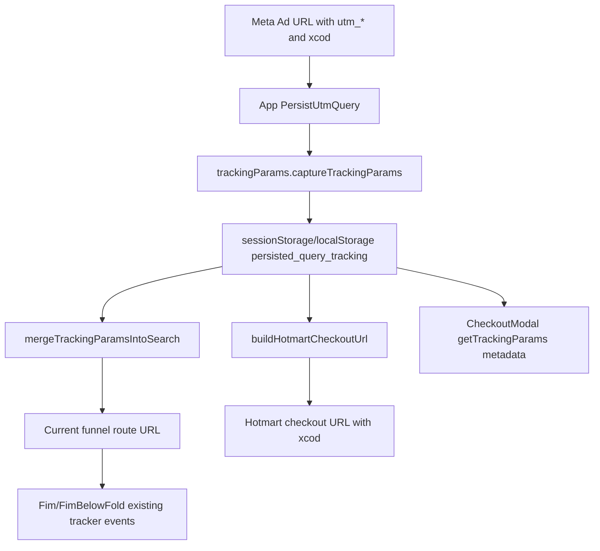

<!--
Planning output for Meta/Hotmart tracking parameter preservation.
Main responsibilities: document audited code references, implementation logic, risk, rollback, and verification before code execution.
-->

# Meta/Hotmart XCOD Tracking Preservation — Planning Output (v1)

> **Status:** PLANEJADO — Aguardando aprovação  
> **Data:** 2026-05-08  
> **Scope:** `/fim`, checkout redirect from `FimBelowFold`, shared tracking parameter utilities  
> **Files:** 3 implementation files (1 new test file, 2 modified files)  
> **Risk:** 🟡 MEDIUM

---

## 1. Contexto

The acquisition funnel receives Meta ad traffic with this paid-traffic query string:

```text
utm_source=FB&utm_campaign={{campaign.name}}|{{campaign.id}}&utm_medium={{adset.name}}|{{adset.id}}&utm_content={{ad.name}}|{{ad.id}}&utm_term={{placement}}&xcod=FBhQwK21wXxR{{campaign.name}}|{{campaign.id}}hQwK21wXxR{{adset.name}}|{{adset.id}}hQwK21wXxR{{ad.name}}|{{ad.id}}hQwK21wXxR{{placement}}
```

The current implementation already has a central persistence pipeline for paid-traffic params:

- `App.tsx` captures query params and reapplies them during client-side navigation.
- `hotmartCheckout.ts` appends persisted tracking params to the Hotmart checkout URL.
- `CheckoutModal.jsx` sends `getTrackingParams()` inside Stripe metadata.

The likely root cause is that `xcod` is not classified as a tracking parameter in `trackingParams.ts`; only `utm_*` and selected click IDs are persisted. Therefore `xcod` is lost before the checkout redirect and before payment metadata enrichment.

External validation:

- Context7 React docs confirm `useEffect` is the right place for synchronization with browser APIs such as `localStorage`, DOM, and external state, with dependency arrays controlling reruns.
- Context7 React Router docs confirm URL search parameters are route state and can be read/updated through Router APIs such as `useLocation`, `useNavigate`, and `useSearchParams`.
- Utmify Help Center, in its untracked-sales troubleshooting article, instructs Hotmart users to validate that the UTMs script is installed across the funnel, shows the Hotmart script with `data-utmify-prevent-subids`, and explicitly recommends `xcod` for Hotmart recovery/source tracking.
- Hotmart Help Center confirms checkout links support query parameters and that additional parameters must be added with `&` when the link already has an existing query string.

No database schema change is proposed.

### Technical Mapping

**Issue:** Meta/Hotmart acquisition source parameters are not reliably preserved until purchase/checkout.

**Suspected Root Cause:** `xcod` is dropped by `isTrackingParam()` because the whitelist only accepts `utm_*` and click ID keys. The checkout URL builder correctly appends persisted params, but it never receives `xcod`.

**Target Outcome:** The full `xcod` value from Meta ad URLs is captured, persisted in `sessionStorage`/`localStorage`, reapplied to route URLs, appended to Hotmart checkout URLs, and available in checkout metadata.

**Risks & Mitigation:** Adding a tracking key affects all routes using `PersistUtmQuery`; mitigate with targeted unit tests around capture, URL merge, and checkout URL generation. Existing behavior for `utm_*`, `fbclid`, `sck`, `paymentMethod`, `email`, and `leadIdShort` must remain unchanged.

### Risk Classification

Point #1: Preserve `xcod` across the funnel and checkout
├── Risk Level: 🟡 MEDIUM  
├── Blast Radius: `trackingParams.ts`, route query persistence, Hotmart checkout URL, checkout metadata  
├── Regression Surface: URL query merge order, duplicate params, checkout URL params, stored tracking payload  
└── Confidence: HIGH based on audit of `App.tsx`, `trackingParams.ts`, `hotmartCheckout.ts`, `FimBelowFold.jsx`

---

## 2. Referência de Código Mapeada

### 2.1 Current Tracking Param Whitelist

[trackingParams.ts L6-L23](file:///Users/brunogovas/Projects/Funnel_Quiz/silverbullet-frequencia-quiz/src/lib/trackingParams.ts#L6-L23)

```ts
const STORAGE_KEY = 'persisted_query_tracking'

const CLICK_ID_KEYS = new Set([
  'fbclid',
  'gclid',
  'ttclid',
  'msclkid',
  'wbraid',
  'gbraid',
])

export function isTrackingParam(key: string): boolean {
  const normalized = String(key || '').trim().toLowerCase()
  if (!normalized) return false
  if (normalized.startsWith('utm_')) return true
  if (CLICK_ID_KEYS.has(normalized)) return true
  return false
}
```

↑ This is the main point to extend. `xcod` is currently not accepted.

### 2.2 Current Capture and Reapply Pipeline

[trackingParams.ts L49-L70](file:///Users/brunogovas/Projects/Funnel_Quiz/silverbullet-frequencia-quiz/src/lib/trackingParams.ts#L49-L70)

```ts
export function captureTrackingParams(search?: string): Record<string, string> {
  const stored = readStoredTrackingParams()
  const params = new URLSearchParams(
    typeof search === 'string'
      ? search.replace(/^\?/, '')
      : (typeof window !== 'undefined' ? window.location.search.replace(/^\?/, '') : '')
  )
  let changed = false

  params.forEach((value, key) => {
    if (!isTrackingParam(key)) return
    const normalizedKey = key.toLowerCase()
    const normalizedValue = String(value || '').trim()
    if (!normalizedValue) return
    if (stored[normalizedKey] !== normalizedValue) {
      stored[normalizedKey] = normalizedValue
      changed = true
    }
  })

  if (changed) writeStoredTrackingParams(stored)
  return stored
}
```

↑ Once `xcod` is accepted by `isTrackingParam`, this existing capture path will persist it without page-level changes.

### 2.3 App-Level Query Preservation

[App.tsx L167-L189](file:///Users/brunogovas/Projects/Funnel_Quiz/silverbullet-frequencia-quiz/src/App.tsx#L167-L189)

```tsx
function PersistUtmQuery() {
  const location = useLocation()
  const navigate = useNavigate()

  useEffect(() => {
    captureTrackingParams(location.search)
    const nextSearch = mergeTrackingParamsIntoSearch(location.search || '')
    const currentSearch = String(location.search || '').replace(/^\?/, '')
    if (currentSearch === nextSearch) return

    try {
      navigate(
        {
          pathname: location.pathname,
          search: nextSearch ? `?${nextSearch}` : '',
          hash: location.hash || '',
        },
        { replace: true, state: location.state },
      )
    } catch {
      void 0
    }
  }, [location.pathname, location.search, location.hash, navigate])

  return null
}
```

↑ This effect already synchronizes the URL with persisted tracking params. No structural change is planned here.

### 2.4 Hotmart Checkout URL Builder

[hotmartCheckout.ts L42-L68](file:///Users/brunogovas/Projects/Funnel_Quiz/silverbullet-frequencia-quiz/src/lib/hotmartCheckout.ts#L42-L68)

```ts
export const buildHotmartCheckoutUrl = ({
  baseUrl,
  paymentMethod,
  leadIdShort,
  email,
}: BuildCheckoutParams): string => {
  try {
    const url = new URL(baseUrl)

    if (paymentMethod) {
      url.searchParams.set('paymentMethod', normalizeHotmartPaymentMethod(paymentMethod))
    }

    if (leadIdShort) {
      url.searchParams.set('sck', leadIdShort.substring(0, 30).replace(/_/g, ''))
    }

    if (email) {
      url.searchParams.set('email', email.trim())
    }

    return appendTrackingParamsToUrl(url.toString())
  } catch (error) {
    console.error('[HOTMART] Erro ao construir URL do checkout', { baseUrl, message: error instanceof Error ? error.message : String(error) })
    return baseUrl
  }
}
```

↑ This builder already appends persisted tracking params. It should start carrying `xcod` after the whitelist fix.

### 2.5 FimBelowFold Checkout Redirect

[FimBelowFold.jsx L204-L218](file:///Users/brunogovas/Projects/Funnel_Quiz/silverbullet-frequencia-quiz/src/pages/FimBelowFold.jsx#L204-L218)

```jsx
const redirectToMainCheckout = async (methodId) => {
    const { leadIdShort, email, paymentMethod } = await handleCheckoutTracking(methodId, checkoutOriginRef.current)

    // Anti-Race Condition Buffer: Garante que a promessa de tracking tenha
    // 80ms de processamento dentro do event loop antes da pagina ser destruida
    await new Promise(resolve => setTimeout(resolve, 80))

    const checkoutUrl = buildHotmartCheckoutUrl({
        baseUrl: HOTMART_MAIN_CHECKOUT_URL,
        paymentMethod: paymentMethod || undefined,
        leadIdShort: leadIdShort || undefined,
        email: email || undefined
    })

    window.location.href = checkoutUrl
}
```

↑ This page-level code already uses the shared checkout builder. No direct modification to `FimBelowFold.jsx` is planned unless validation shows a route-specific gap.

### 2.6 Fim Page Tracking Hooks

[Fim.jsx L101-L115](file:///Users/brunogovas/Projects/Funnel_Quiz/silverbullet-frequencia-quiz/src/pages/Fim.jsx#L101-L115)

```jsx
// Inicializar o tracker no carregamento da página
try {
  const tracker = createFunnelTracker({
    baseUrl: getDefaultBaseUrl(),
    funnelId: QUIZ_FUNNEL_ID,
    getCountry: () => readStoredCountry() || undefined,
    debug: DEBUG
  });

  const step = buildRouteStep('/fim', QUIZ_PROGRESS_STEPS.fim);
  if (shouldSendEvent('step_view:/fim')) {
    tracker.stepView(step).catch((err) => {
      console.error('[FIM] Erro ao enviar step_view:', err);
    });
  }
} catch (e) {
  console.error('[FIM] Falha ao inicializar tracker', e);
}
```

↑ Existing `funnelTracker` page event should continue firing; validation must confirm no regression.

### 2.7 Checkout Metadata Tracking

[CheckoutModal.jsx L283-L288](file:///Users/brunogovas/Projects/Funnel_Quiz/silverbullet-frequencia-quiz/src/components/CheckoutModal.jsx#L283-L288)

```jsx
const initDadosEntrada = { amount_cents: amt, currency: cur, email: normalizedEmail }
try {
  console.log(`[CHECKOUT] Iniciando operação: ${initOperacao}`, { dados_entrada: initDadosEntrada })
  const cachedLeadId = typeof window !== 'undefined' ? (window.localStorage.getItem('lead_id') || leadCache.getAll()?.lead_id) : '';
  const combinedMetadata = { ...(metadata || {}), ...getTrackingParams(), lead_id: cachedLeadId };
  const data = await createPaymentIntent({ amount_cents: amt, currency: cur, email: normalizedEmail, metadata: combinedMetadata })
```

↑ Stripe/local checkout metadata will also receive `xcod` once `getTrackingParams()` captures it.

### 2.8 Utmify Script Installed for Hotmart

[index.html L6-L7](file:///Users/brunogovas/Projects/Funnel_Quiz/silverbullet-frequencia-quiz/index.html#L6-L7)

```html
<!-- UTMify: Rastreamento de UTMs para atribuição de vendas por anúncio -->
<script src="https://cdn.utmify.com.br/scripts/utms/latest.js" data-utmify-prevent-subids async defer></script>
```

↑ The installed script matches Utmify's Hotmart guidance. No script tag change is planned; the app must preserve the incoming `xcod` until the Hotmart URL is built.

---

## 3. Lógica de Implementação

### 3.1 Accept Meta/Hotmart Acquisition Params

**Origem:** `[CRIADO]` + `[REPO EXISTENTE]`

```ts
const CLICK_ID_KEYS = new Set([
  'fbclid',
  'gclid',
  'ttclid',
  'msclkid',
  'wbraid',
  'gbraid',
])

const ATTRIBUTION_PARAM_KEYS = new Set([
  'xcod',
])

export function isTrackingParam(key: string): boolean {
  const normalized = String(key || '').trim().toLowerCase()
  if (!normalized) return false
  if (normalized.startsWith('utm_')) return true
  if (CLICK_ID_KEYS.has(normalized)) return true
  if (ATTRIBUTION_PARAM_KEYS.has(normalized)) return true
  return false
}
```

Flow: Preserve the existing `utm_*` and click ID behavior, add an explicit allowlist for non-UTM attribution params, and include only `xcod` for this requested adjustment.

### 3.2 Existing Route Persistence Remains the Sync Point

**Origem:** `[REPO EXISTENTE]` + `[CONTEXT7]`

```tsx
useEffect(() => {
  captureTrackingParams(location.search)
  const nextSearch = mergeTrackingParamsIntoSearch(location.search || '')
  const currentSearch = String(location.search || '').replace(/^\?/, '')
  if (currentSearch === nextSearch) return

  navigate(
    {
      pathname: location.pathname,
      search: nextSearch ? `?${nextSearch}` : '',
      hash: location.hash || '',
    },
    { replace: true, state: location.state },
  )
}, [location.pathname, location.search, location.hash, navigate])
```

Flow: Context7 React guidance supports using `useEffect` to synchronize with browser APIs and external systems. This existing effect remains the single route-level sync point; the implementation does not add page-specific URL mutation in `Fim.jsx` or `FimBelowFold.jsx`.

### 3.3 Checkout URL Carries `xcod`

**Origem:** `[REPO EXISTENTE]`

```ts
export const buildHotmartCheckoutUrl = ({
  baseUrl,
  paymentMethod,
  leadIdShort,
  email,
}: BuildCheckoutParams): string => {
  const url = new URL(baseUrl)

  if (paymentMethod) {
    url.searchParams.set('paymentMethod', normalizeHotmartPaymentMethod(paymentMethod))
  }

  if (leadIdShort) {
    url.searchParams.set('sck', leadIdShort.substring(0, 30).replace(/_/g, ''))
  }

  if (email) {
    url.searchParams.set('email', email.trim())
  }

  return appendTrackingParamsToUrl(url.toString())
}
```

Flow: No new checkout-specific logic is needed. `appendTrackingParamsToUrl()` will include `xcod` after capture. Existing first-party params (`paymentMethod`, `sck`, `email`) remain set before merge.

### 3.4 Unit Test for Capture and Checkout URL Preservation

**Origem:** `[CRIADO]`

```ts
import { describe, expect, it, beforeEach } from 'vitest'

import {
  appendTrackingParamsToUrl,
  captureTrackingParams,
  readStoredTrackingParams,
} from '../trackingParams'

describe('trackingParams', () => {
  beforeEach(() => {
    window.localStorage.clear()
    window.sessionStorage.clear()
  })

  it('captures xcod together with Meta UTM params', () => {
    captureTrackingParams('?utm_source=FB&utm_campaign=Campaign%7C123&xcod=FBhQwK21wXxRCampaign%7C123')

    expect(readStoredTrackingParams()).toMatchObject({
      utm_source: 'FB',
      utm_campaign: 'Campaign|123',
      xcod: 'FBhQwK21wXxRCampaign|123',
    })
  })

  it('appends xcod to checkout urls without replacing existing checkout params', () => {
    captureTrackingParams('?utm_source=FB&xcod=FBhQwK21wXxRAd%7C999')

    const result = appendTrackingParamsToUrl('https://pay.hotmart.com/N105101154W?checkoutMode=10&sck=abc123')
    const url = new URL(result)

    expect(url.searchParams.get('checkoutMode')).toBe('10')
    expect(url.searchParams.get('sck')).toBe('abc123')
    expect(url.searchParams.get('utm_source')).toBe('FB')
    expect(url.searchParams.get('xcod')).toBe('FBhQwK21wXxRAd|999')
  })
})
```

Flow: This proves the failing case before implementation and guards against regressions in storage and URL merge behavior.

### 3.5 Unit Test for Hotmart URL Builder

**Origem:** `[CRIADO]` + `[REPO EXISTENTE]`

```ts
import { buildHotmartCheckoutUrl } from '../hotmartCheckout'
import { captureTrackingParams } from '../trackingParams'

it('preserves xcod when building Hotmart checkout url', () => {
  captureTrackingParams('?utm_source=FB&xcod=FBhQwK21wXxRAd%7C999')

  const result = buildHotmartCheckoutUrl({
    baseUrl: 'https://pay.hotmart.com/N105101154W?checkoutMode=10',
    leadIdShort: 'leadshort123',
    email: 'buyer@example.com',
  })
  const url = new URL(result)

  expect(url.searchParams.get('checkoutMode')).toBe('10')
  expect(url.searchParams.get('sck')).toBe('leadshort123')
  expect(url.searchParams.get('email')).toBe('buyer@example.com')
  expect(url.searchParams.get('utm_source')).toBe('FB')
  expect(url.searchParams.get('xcod')).toBe('FBhQwK21wXxRAd|999')
})
```

Flow: Confirms the real checkout path used by `FimBelowFold.jsx` receives the parameter.

---

## 4. Arquitetura de Componentes



---

## 5. CSS/SCSS Reference

No CSS/SCSS changes are planned.

| Propriedade | Valor Original | Novo Valor |
|-------------|---------------|------------|
| N/A | N/A | N/A |

---

## 6. Novos Componentes

No new React components are planned.

### 6.1 `trackingParams.test.ts`

**Path:** `/Users/brunogovas/Projects/Funnel_Quiz/silverbullet-frequencia-quiz/src/lib/__tests__/trackingParams.test.ts`

#### Props

```tsx
// N/A - test file
```

#### Lógica Core

```ts
captureTrackingParams('?utm_source=FB&xcod=FBhQwK21wXxRAd%7C999')
const result = appendTrackingParamsToUrl('https://pay.hotmart.com/N105101154W?checkoutMode=10&sck=abc123')
const url = new URL(result)

expect(url.searchParams.get('xcod')).toBe('FBhQwK21wXxRAd|999')
```

---

## 7. Componentes Modificados

### 7.1 `trackingParams.ts`

**Novos states/hooks:**

```ts
// N/A - shared utility, no React state
```

**Modificações no código existente:**

```ts
const ATTRIBUTION_PARAM_KEYS = new Set([
  'xcod',
])

export function isTrackingParam(key: string): boolean {
  const normalized = String(key || '').trim().toLowerCase()
  if (!normalized) return false
  if (normalized.startsWith('utm_')) return true
  if (CLICK_ID_KEYS.has(normalized)) return true
  if (ATTRIBUTION_PARAM_KEYS.has(normalized)) return true
  return false
}
```

**Props adicionais para sub-componentes:**

```tsx
// N/A
```

### 7.2 `hotmartCheckout.test.ts`

**Novos states/hooks:**

```ts
// N/A - test file
```

**Modificações no código existente:**

```ts
import { buildCheckoutJourneyContext, buildHotmartCheckoutUrl } from '../hotmartCheckout'
import { captureTrackingParams } from '../trackingParams'
```

```ts
it('preserves xcod when building Hotmart checkout url', () => {
  captureTrackingParams('?utm_source=FB&xcod=FBhQwK21wXxRAd%7C999')
  const result = buildHotmartCheckoutUrl({
    baseUrl: 'https://pay.hotmart.com/N105101154W?checkoutMode=10',
    leadIdShort: 'leadshort123',
    email: 'buyer@example.com',
  })
  const url = new URL(result)
  expect(url.searchParams.get('xcod')).toBe('FBhQwK21wXxRAd|999')
})
```

### 7.3 `Fim.jsx` and `FimBelowFold.jsx`

No code changes are planned in the two requested page files unless manual validation exposes a page-specific gap. They are still included in verification because they are the affected funnel surface.

---

## 8. i18n Keys (se aplicável)

No i18n keys are planned.

### 8.1 Novas Chaves

```json
{}
```

### 8.2 Plano de Verificação Anti-Reversão

```bash
npm run typecheck
npx vitest run src/lib/__tests__/trackingParams.test.ts src/lib/__tests__/hotmartCheckout.test.ts
```

---

## 9. Files Summary

| Action | File | Risk |
|--------|------|------|
| **MODIFY** | `/Users/brunogovas/Projects/Funnel_Quiz/silverbullet-frequencia-quiz/src/lib/trackingParams.ts` | 🟡 MEDIUM |
| **NEW** | `/Users/brunogovas/Projects/Funnel_Quiz/silverbullet-frequencia-quiz/src/lib/__tests__/trackingParams.test.ts` | 🟢 LOW |
| **MODIFY** | `/Users/brunogovas/Projects/Funnel_Quiz/silverbullet-frequencia-quiz/src/lib/__tests__/hotmartCheckout.test.ts` | 🟢 LOW |
| **VERIFY ONLY** | `/Users/brunogovas/Projects/Funnel_Quiz/silverbullet-frequencia-quiz/index.html` | 🟢 LOW |
| **VERIFY ONLY** | `/Users/brunogovas/Projects/Funnel_Quiz/silverbullet-frequencia-quiz/src/pages/Fim.jsx` | 🟢 LOW |
| **VERIFY ONLY** | `/Users/brunogovas/Projects/Funnel_Quiz/silverbullet-frequencia-quiz/src/pages/FimBelowFold.jsx` | 🟢 LOW |

---

## 10. Implementation Order

1. **Phase A:** Add `xcod` to the shared attribution allowlist in `trackingParams.ts`.
2. **Phase B:** Add focused tests for storage capture and URL merge preservation.
3. **Phase C:** Extend `hotmartCheckout.test.ts` to cover the real Hotmart builder path.
4. **Phase D:** Run targeted Vitest tests.
5. **Phase E:** Run `npm run typecheck`.
6. **Phase F:** Manually validate `/fim?utm_source=FB&...&xcod=...` to confirm the final Hotmart URL includes `xcod`.

---

## 11. Rollback Plan

Point #1 Rollback:
├── Git Reference: `c149eaf` before implementation planning  
├── Files to Revert:  
│   ├── `/Users/brunogovas/Projects/Funnel_Quiz/silverbullet-frequencia-quiz/src/lib/trackingParams.ts`  
│   ├── `/Users/brunogovas/Projects/Funnel_Quiz/silverbullet-frequencia-quiz/src/lib/__tests__/trackingParams.test.ts`  
│   └── `/Users/brunogovas/Projects/Funnel_Quiz/silverbullet-frequencia-quiz/src/lib/__tests__/hotmartCheckout.test.ts`  
├── Revert Command: `git checkout c149eaf -- src/lib/trackingParams.ts src/lib/__tests__/hotmartCheckout.test.ts && rm src/lib/__tests__/trackingParams.test.ts`  
└── Post-Revert Validation: run `npx vitest run src/lib/__tests__/hotmartCheckout.test.ts`

Note: If implementation starts after more commits, replace `c149eaf` with the pre-implementation commit captured immediately before editing.

---

## 12. Verification Plan

| # | Test Case | Route | Expected |
|---|-----------|-------|----------|
| 1 | Unit: `isTrackingParam('xcod')` through `captureTrackingParams` | N/A | `readStoredTrackingParams().xcod` equals original decoded value |
| 2 | Unit: append stored `xcod` to existing checkout URL | N/A | `checkoutMode`, `sck`, `utm_source`, and `xcod` all remain present |
| 3 | Unit: `buildHotmartCheckoutUrl` with stored `xcod` | N/A | Hotmart URL includes `xcod` and keeps `email`/`sck` |
| 4 | Manual: load `/fim` with full Meta query string | `/fim?...&xcod=...` | Browser URL keeps `xcod` after `PersistUtmQuery` runs |
| 5 | Manual: trigger checkout from `FimBelowFold` | `/fim` | Redirect URL to `pay.hotmart.com` includes `xcod` |
| 6 | Compatibility: existing `step_view` and `checkout_start` still fire | `/fim` | No new console errors; existing tracking calls are not blocked |
| 7 | Build/type gate | N/A | `npm run typecheck` passes |

Quality Gates:

| Gate | Required | Planned Method |
|------|----------|----------------|
| Visual Verification | ✅ | Manual `/fim` smoke check; no UI changes expected |
| Console Error Check | ✅ | Browser console during manual checkout URL validation |
| State Integrity Audit | ✅ | Confirm storage writes to `persisted_query_tracking` preserve previous params |
| Build Validation | Optional for medium, recommended | `npm run typecheck` |
| Stakeholder Sign-off | ✅ | Required before implementation |

---

## 13. Handoff (se aplicável)

### 13.1 Hotmart / Meta Attribution

- **O que é necessário:** After deployment, run one real test click URL with the full Meta parameter set and confirm the final Hotmart checkout URL contains `xcod`, `utm_source`, `utm_campaign`, `utm_medium`, `utm_content`, and `utm_term`.
- **External references:** Utmify untracked-sales troubleshooting: https://utmify.help.center/article/1024-voce-esta-tendo-vendas-nao-trackeadas; Hotmart checkout parameters: https://help.hotmart.com/en/article/115003588572/how-do-i-set-up-my-checkout-parameters-
- **Documento de handoff:** This pre-flight file can serve as handoff unless implementation discovers a backend or Hotmart dashboard configuration gap.

---

## Approval Gate

Implementation is blocked until stakeholder approval.

Approve this plan to proceed with the scoped code changes and validation.
