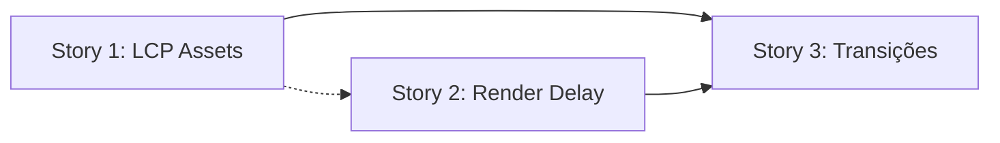

# Epic 003: PageSpeed LCP & Transições Fluídas

**Status:** Draft  
**Priority:** Critical  
**Owner:** PM (Morgan)  
**Criado em:** 2026-02-19  
**Referência:** [pagessped.md](file:///Users/brunogovas/Projects/Silver%20Bullet/Funil-Quiz/docs/research/pagessped.md)

---

## 🎯 Epic Goal

Eliminar os gargalos de LCP em todas as páginas do quiz funnel e criar uma percepção de transição fluída entre páginas para o usuário final, resultando em uma experiência premium comparável a Typeform e quizzes nativos de alta conversão.

---

## 📝 Epic Description

### Existing System Context

- **Situação atual:** 11 das 13+ páginas auditadas têm LCP score ≥ 7 (péssimo). Quiz Steps apresentam element render delays de até **25,670 ms**
- **Stack:** Vite + React + React Router DOM + SCSS Modules
- **Arquitetura atual:** Todas as 27 rotas utilizam `React.lazy()` com `Suspense` e um fallback genérico ("Carregando…")
- **Transições:** Corte abrupto entre páginas — sem animações nem visual continuity
- **LCP Elements:** Mix de imagens (age-selection, resultado, women-success) e headings `<h2>` (quiz steps)
- **Domínio de produção:** fundaris.space

### Problemas Recorrentes Identificados

| Problema | Páginas Afetadas | Impacto |
|----------|-----------------|---------|
| `fetchpriority=high` ausente | age-selection-woman/man, men-success, women-success, transition, resultado, recupera, audio-upsell | Imagem LCP não priorizada |
| Imagem LCP não descobrível no HTML | age-selection-woman/man, men-success, women-success, transition, resultado, recupera, audio-upsell | Browser não inicia download cedo |
| Element render delay extremo (>10s) | Quiz Steps 2-6, resultado, fim, vsl | JS blocking: lazy chunk + parse + render |
| Imagens grandes sem compressão | women-success (401 KiB), resultado (101 KiB → 68.6 KiB savings) | Download lento |
| Transição abrupta entre páginas | Todas | UX ruim, sensação de "quebra" |

### Enhancement Details

**O que muda:**
1. Otimização técnica de LCP (priorização de assets, compressão, preload)
2. Redução de element render delay nos quiz steps
3. Sistema de transições fluídas entre páginas (fade/slide)
4. Prefetch inteligente do próximo passo do funnel

**Critérios de sucesso:**
- LCP score ≤ 4 em todas as páginas (ideal: ≤ 2.5s)
- Transições entre páginas com animação visível (fade-in/fade-out mínimo)
- Sem regressão visual ou funcional em checkout, vídeo e tracking
- Percepção subjetiva de fluidez confirmada em teste manual mobile 3G

---

## 🔬 Pesquisa & Benchmarks

### Como Outros Resolveram

#### Typeform (Referência Principal)
- Perguntas aparecem uma por vez com **slide-up + fade CSS**
- `@keyframes` CSS + JS para controlar timing de transição
- Design "conversacional" — visual continuity entre steps
- Respeita `prefers-reduced-motion` (acessibilidade)
- Animações built-in, não customizáveis pelo usuário

#### View Transitions API (Padrão Web Moderno)
- API nativa do browser (Chrome 111+, Edge 111+)
- `document.startViewTransition()` captura snapshot do DOM antigo/novo e anima diferenças
- Hardware-accelerated, muito performático
- React Router v7 tem prop `viewTransition` integrada
- **Compatibilidade:** Safari ainda experimental — precisa de fallback CSS

#### Padrões Validados da Indústria
| Técnica | Descrição | Para Nosso Caso |
|---------|-----------|-----------------|
| Preload do próximo passo | Prefetch assets enquanto o usuário responde | Quiz steps, transições |
| Skeleton screens | Placeholder visual enquanto JS executa | Quiz steps (element render delay) |
| Fade-in progressivo | Conteúdo aparece gradualmente | Todas as páginas |
| Shared element transitions | Header/progress bar persistem | Quiz flow inteiro |

#### Case Studies com Dados Reais
| Empresa | Ação | Resultado |
|---------|------|----------|
| Renault | LCP < 1s | -14pp bounce rate, +13% conversões |
| Estudo geral | LCP < 2s vs 5s | Usuários convertem 2x mais |
| A/B Test | LCP 8.3s → 5.7s | +11% a +15% vendas |

---

## 📚 Stories

### Story 1: Otimização de LCP — Assets & Priorização

**Objetivo:** Resolver os problemas técnicos de LCP em todas as páginas com imagens como LCP element.

**Páginas alvo:** age-selection-woman, age-selection-man, men-success, women-success, transition, resultado, recupera, audio-upsell

**Predicted Agents:** @dev  
**Quality Gates:**
- Pre-Commit: Lighthouse audit local por página
- Pre-PR: Comparação before/after de LCP metrics

**Tarefas:**
- [ ] Adicionar `fetchpriority="high"` em todas as imagens LCP above-the-fold
- [ ] Remover `loading="lazy"` de imagens LCP (above-the-fold)
- [ ] Adicionar `<link rel="preload" as="image">` no `<head>` para imagens LCP críticas
- [ ] Comprimir women-success image (401 KiB → target < 100 KiB)
- [ ] Comprimir resultado image (101 KiB → target < 50 KiB via melhor compressão WebP/AVIF)
- [ ] Auditar e otimizar tamanhos de imagem em todas as páginas restantes
- [ ] Adicionar `decoding="async"` em imagens não-LCP
- [ ] Fix: /recupera — adicionar `fetchpriority="high"` na hero image (`Usuario-CBxXIoyu.webp`), remover lazy load
- [ ] Fix: /audio-upsell — adicionar `fetchpriority="high"` na `expertAvatar`

**Definition of Done:**
- [ ] LCP score ≤ 4 em age-selection-woman/man, men-success, women-success, transition, resultado, recupera, audio-upsell

---

### Story 2: Redução de Element Render Delay — Quiz Steps & Páginas JS-Heavy

**Objetivo:** Reduzir o element render delay extremo (até 25s) nos quiz steps e páginas com LCP baseado em texto/componentes.

**Páginas alvo:** Quiz Steps 1-6, vsl, resultado, fim

**Predicted Agents:** @dev, @architect (se envolver reestruturação de imports)  
**Quality Gates:**
- Pre-Commit: Lighthouse per-page audit, bundle analysis
- Pre-PR: Performance profiling comparison

**Tarefas:**
- [ ] Analisar bundle chunks — identificar quais módulos estão nos chunks dos quiz steps
- [ ] Avaliar se InitialQuestions (importado eagerly) deveria ser lazy
- [ ] Investigar se o element render delay é causado por hydration ou por dependências pesadas no chunk
- [ ] Implementar code splitting mais granular onde necessário (separar dependências pesadas)
- [ ] Considerar SSR-like approach (prerender dos quiz step headings no Suspense fallback)
- [ ] Otimizar o Suspense fallback: trocar texto genérico por skeleton que simula o layout da próxima página
- [ ] Avaliar react-router prefetch/preload de chunks do próximo step
- [ ] Otimizar /vsl — reduzir element render delay de 1,650 ms (video LCP element)

**Definition of Done:**
- [ ] Element render delay < 2s em todos os quiz steps
- [ ] LCP score ≤ 4 em quiz steps e resultado

---

### Story 3: Sistema de Transições Fluídas entre Páginas

**Objetivo:** Criar uma experiência de transição suave e contínua entre todas as páginas do funnel, inspirado no padrão Typeform.

**Todas as páginas do funnel**

**Predicted Agents:** @dev, @ux-expert (validação de feel)  
**Quality Gates:**
- Pre-Commit: Teste visual manual, `prefers-reduced-motion` check
- Pre-PR: Recording de navegação completa do funnel, teste em mobile 3G

**Tarefas:**
- [ ] Criar componente `PageTransition` wrapper com animação CSS (fade-in/fade-out como base)
- [ ] Implementar usando `document.startViewTransition()` com fallback CSS para browsers sem suporte
- [ ] Aplicar transição em todas as rotas via wrapper no `App.tsx` (dentro do `<Suspense>`)
- [ ] Adicionar animações específicas para quiz flow (slide-up para próxima pergunta, slide-down para anterior)
- [ ] Garantir que shared elements (header, progress bar) persistam sem flickering durante transição
- [ ] Implementar `prefers-reduced-motion` — degradar para transição simples (fade rápido)
- [ ] Prefetch do chunk da próxima página em `onMouseDown`/`onClick` (antes da navegação)
- [ ] Testar em mobile: transição não pode adicionar delay perceptível à navegação

**Definition of Done:**
- [ ] Todas as transições de página são animadas (fade mínimo 200ms)
- [ ] Quiz flow tem animação direcional (slide-up/down)
- [ ] Header/progress bar não flicker durante transição
- [ ] Funcional em Chrome, Safari e Firefox
- [ ] `prefers-reduced-motion` respeitado

---

## 🗺 Affected Files Map

### Files to MODIFY

| File | What Changes | Why |
|------|-------------|-----|
| `src/App.tsx` | Wrapper de transição no Suspense, prefetch logic | Hub central de rotas |
| `src/pages/AgeSelectionWomen.jsx` | `fetchpriority`, preload, image sizes | LCP image fix |
| `src/pages/AgeSelectionMen.jsx` | `fetchpriority`, preload, image sizes | LCP image fix |
| `src/pages/MenSuccess.jsx` | `fetchpriority`, preload | LCP image fix |
| `src/pages/WomenSuccess.jsx` | `fetchpriority`, preload, image compression | LCP image fix (401 KiB) |
| `src/pages/TransitionPage.jsx` | `fetchpriority`, preload | LCP image fix |
| `src/pages/Resultado.jsx` | `fetchpriority`, preload, lazy removal | LCP image fix |
| `src/pages/Recupera.jsx` | `fetchpriority`, preload, lazy removal na hero image | LCP image fix |
| `src/pages/AudioUpsell.jsx` | `fetchpriority` na expertAvatar | LCP image fix |
| `src/pages/VSL.jsx` | Render delay optimization | Element render delay (1,650 ms) |
| `src/pages/QuizStep1.jsx` — `QuizStep6.jsx` | Code split review, skeleton fallback | Element render delay |
| `src/pages/Fim.jsx` | Render delay optimization | Element render delay |
| `index.html` | `<link rel="preload">` para imagens LCP das landing pages | Discoverable from HTML |

### Files to CREATE

| File | Purpose | Based On |
|------|---------|----------|
| `src/components/PageTransition.jsx` | Wrapper de transição fluída | View Transitions API + CSS fallback |
| `src/components/PageTransition.module.scss` | Animações de transição | Typeform-style CSS keyframes |
| `src/hooks/usePrefetch.js` | Hook de prefetch do próximo chunk | React.lazy prefetch pattern |

---

## 🛡 Risk Mitigation

- **Primary Risk:** Animações de transição podem adicionar delay percebido se mal implementadas ou conflitar com o Suspense fallback
- **Mitigation:** Implementar transição como CSS animations (GPU-accelerated), não blocking. Testar extensivamente em throttled network (3G)
- **Secondary Risk:** Otimizações de image loading podem causar CLS (layout shift) se dimensions não estiverem definidas
- **Mitigation:** Sempre definir `width` e `height` explícitos em imagens LCP
- **Rollback Plan:** Cada story é independente e pode ser revertida via commits isolados. A story 3 (transições) pode ser completamente desabilitada removendo o wrapper

### Quality Assurance Strategy

- **Pre-Commit:** Lighthouse local score check por página modificada
- **Pre-PR:** Bundle size diff, Lighthouse comparison report before/after
- **Pre-Deploy:** Teste manual end-to-end do funnel completo em mobile 3G simulation
- **Monitoring:** Comparação de Core Web Vitals via Google Search Console após deploy

---

## 📐 Sequenciamento

- **Stories 1 e 2** podem ser trabalhadas em paralelo
- **Story 3** depende de 1 e 2 (transições ficam melhores quando as páginas já carregam rápido)

---

## ✅ Definition of Done (Epic)

- [ ] Todas as 3 stories completadas com critérios de aceite atendidos
- [ ] LCP ≤ 4 em todas as páginas do funnel
- [ ] Transições fluídas implementadas em todas as rotas
- [ ] Nenhuma regressão em checkout, VSL, tracking
- [ ] Core Web Vitals validados em ambiente de produção
- [ ] Teste manual em dispositivo real mobile com 3G

---

## 📋 Story Manager Handoff

> "Please develop detailed user stories for this epic. Key considerations:
> - This is an enhancement to an existing system running Vite + React + React Router DOM + SCSS Modules
> - Integration points: React.lazy / Suspense routing, image assets, SCSS modules, AuthorityHeader component
> - Existing patterns to follow: lazy import pattern in App.tsx, SCSS module pattern, existing image handling
> - Critical compatibility requirements: No regression in checkout flow (Stripe, Paypal), VSL playback, UTM persistence, health probe
> - Each story must include verification that existing functionality remains intact
> 
> The epic should maintain system integrity while delivering fluid page transitions and optimal LCP scores."

---

*— Morgan, planejando o futuro 📊*
